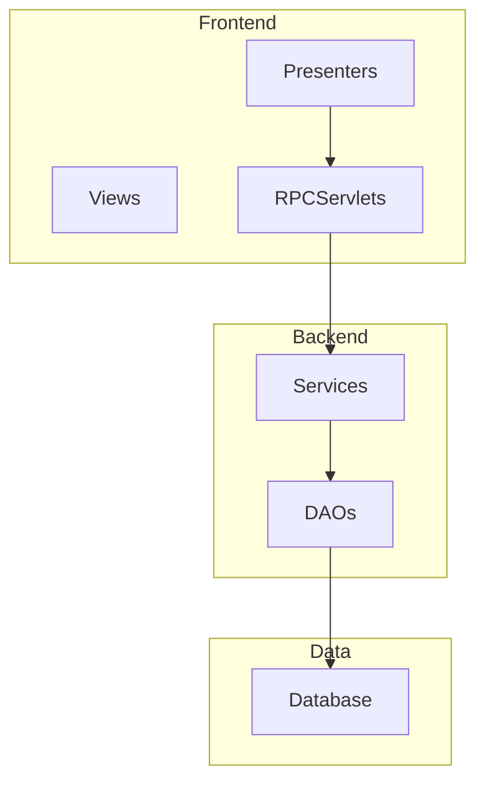
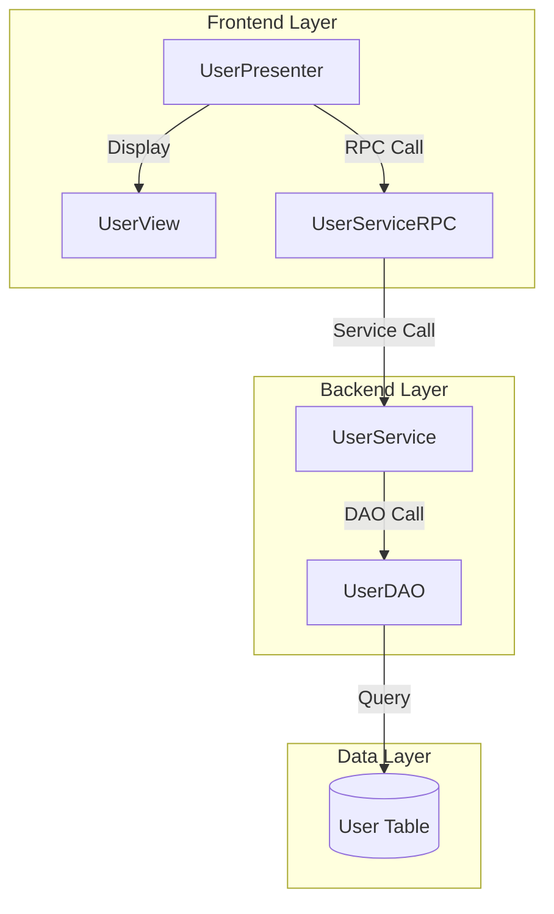
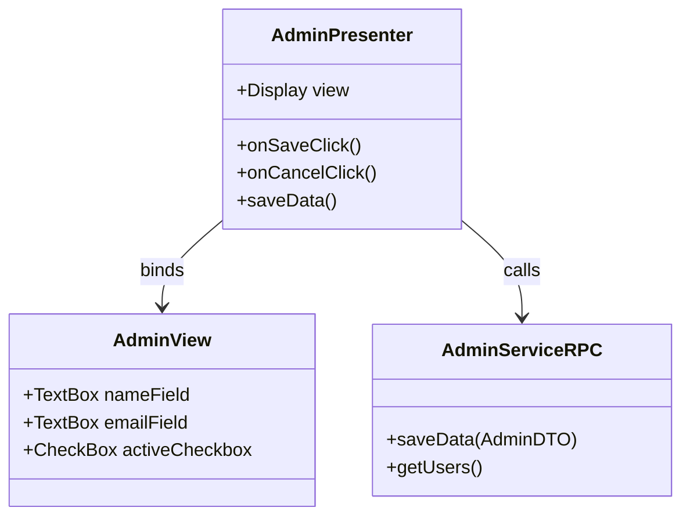
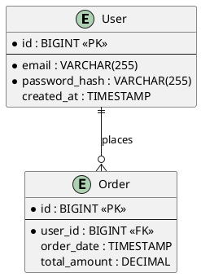
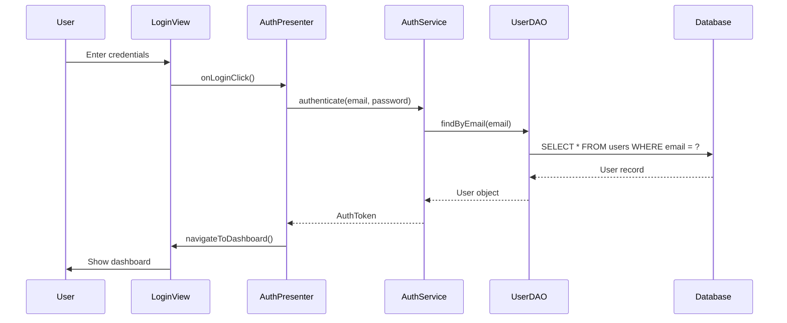

# Architecture Diagram Generation - Feature Design

**Status**: 🎨 Design Phase
**Created**: 2025-12-15
**Priority**: Enhancement

---

## Overview

Generate visual architecture diagrams from indexed codebase artifacts to help developers understand system structure, dependencies, and data flow. Diagrams are exported in multiple formats (Mermaid, PlantUML, D2, DOT/Graphviz) for documentation and analysis.

---

## Objectives

1. **Visualize System Architecture**: Auto-generate diagrams showing components, layers, and relationships
2. **Multiple Diagram Types**: Support component, class, sequence, entity-relationship, and deployment diagrams
3. **Multiple Output Formats**: Export to Mermaid, PlantUML, D2, DOT/Graphviz for flexibility
4. **Integration with PRD**: Link diagrams to PRD documents for comprehensive documentation
5. **Incremental Updates**: Regenerate diagrams when codebase changes

---

## Use Cases

### UC1: Component Architecture Diagram
**Actor**: Technical Architect
**Goal**: Understand high-level system components and dependencies

**Flow**:
1. Run: `codeindex diagram component --project myapp --output diagrams/`
2. System queries Weaviate for all services, DAOs, controllers
3. System identifies dependencies between components
4. System generates component diagram in Mermaid format
5. Diagram shows: Services, DAOs, Controllers, RPC Servlets, and their connections

**Output**:


### UC2: GWT MVP Architecture
**Actor**: Frontend Developer
**Goal**: Visualize GWT presenter-view relationships

**Flow**:
1. Run: `codeindex diagram gwt --project myapp --output diagrams/`
2. System loads GWT presenters and views from PRD artifacts
3. System maps presenter-view bindings with confidence scores
4. System generates GWT-specific architecture diagram
5. Shows: Presenters, Views, Event flows, RPC calls

### UC3: Database Entity-Relationship Diagram
**Actor**: Database Administrator
**Goal**: Understand data model and relationships

**Flow**:
1. Run: `codeindex diagram erd --project myapp --output diagrams/`
2. System queries database entities from Weaviate
3. System identifies foreign key relationships
4. System generates ERD in PlantUML format
5. Shows: Tables, columns, primary keys, foreign keys

### UC4: Sequence Diagram for Business Flow
**Actor**: Business Analyst
**Goal**: Document how a specific feature works

**Flow**:
1. Run: `codeindex diagram sequence --feature "user-login" --output diagrams/`
2. System traces execution flow from frontend to backend
3. System identifies service calls, DAO operations, database queries
4. System generates sequence diagram
5. Shows: User → UI → Controller → Service → DAO → Database

---

## Diagram Types

### 1. Component Diagram
**Purpose**: Show high-level system components and dependencies

**Elements**:
- Components: Services, Controllers, DAOs, RPC Servlets
- Connections: Dependencies, calls, data flow
- Layers: Frontend, Backend, Data
- Frameworks: GWT, Spring, Hibernate

**Format Options**: Mermaid, PlantUML, D2

**Example Mermaid**:


### 2. GWT MVP Diagram
**Purpose**: Document GWT presenter-view-model relationships

**Elements**:
- Presenters with event handlers
- Views with UI fields
- Display interfaces
- RPC Service calls
- Navigation flows

**Format Options**: Mermaid, PlantUML

**Example Mermaid**:


### 3. Entity-Relationship Diagram (ERD)
**Purpose**: Show database schema and relationships

**Elements**:
- Tables with columns and types
- Primary keys
- Foreign keys and relationships
- Indexes
- Constraints

**Format Options**: PlantUML, Mermaid ER, DOT

**Example PlantUML**:


### 4. Sequence Diagram
**Purpose**: Document execution flow for specific features

**Elements**:
- Actors (User, System)
- Components (UI, Service, DAO)
- Messages and calls
- Return values
- Loops and conditions

**Format Options**: Mermaid, PlantUML

**Example Mermaid**:


### 5. Layered Architecture Diagram
**Purpose**: Show architectural layers and tier boundaries

**Elements**:
- Presentation Layer
- Business Logic Layer
- Data Access Layer
- Database Layer
- Cross-cutting concerns (Security, Logging)

**Format Options**: Mermaid, PlantUML, D2

---

## Output Formats

### Mermaid
**Pros**:
- Renders in GitHub, GitLab, Notion
- Simple syntax
- Live preview in many editors

**Cons**:
- Limited customization
- Some diagram types not supported

**Best For**: Component, sequence, ER diagrams

### PlantUML
**Pros**:
- Rich diagram types
- Extensive customization
- Professional output

**Cons**:
- Requires Java runtime
- More complex syntax

**Best For**: Class, sequence, component, ER diagrams

### D2 (Declarative Diagramming)
**Pros**:
- Modern, clean syntax
- Great for technical architecture
- Good customization

**Cons**:
- Newer tool, less adoption
- Requires D2 binary

**Best For**: Architecture, component, deployment diagrams

### DOT/Graphviz
**Pros**:
- Powerful layout algorithms
- Industry standard
- Fine-grained control

**Cons**:
- Complex syntax
- Requires Graphviz installation

**Best For**: Dependency graphs, call graphs, complex networks

---

## Implementation Plan

### Phase 1: Core Infrastructure (MVP)

**T001**: Create diagram generator interface
```python
# src/codeindex/services/diagram_generator.py
class DiagramGenerator:
    def generate_component_diagram(
        self,
        project_id: str,
        output_format: str = "mermaid"
    ) -> str:
        """Generate component architecture diagram."""
        pass
```

**T002**: Implement Mermaid renderer
```python
# src/codeindex/services/diagram_renderers/mermaid_renderer.py
class MermaidRenderer:
    def render_component_diagram(self, components, dependencies) -> str:
        """Render component diagram in Mermaid format."""
        pass
```

**T003**: Add CLI command
```bash
codeindex diagram <type> --project <name> --output <dir> --format <format>
```

**T004**: Query Weaviate for component relationships
```python
# Get all services and their dependencies
services = weaviate_store.get_services(project_id)
dependencies = weaviate_store.get_service_dependencies(project_id)
```

### Phase 2: GWT Support

**T005**: Add GWT MVP diagram generator
```python
def generate_gwt_mvp_diagram(
    self,
    extraction_file: Path,
    output_format: str = "mermaid"
) -> str:
    """Generate GWT presenter-view diagram."""
    pass
```

**T006**: Load GWT artifacts and map relationships
```python
presenters = load_gwt_artifacts_from_extraction(extraction_file)
mappings = map_presenter_view_bindings(presenters, views)
```

**T007**: Render GWT class diagram

### Phase 3: Database ERD

**T008**: Query database entities from Weaviate
```python
entities = weaviate_store.get_database_entities(project_id)
relationships = extract_foreign_key_relationships(entities)
```

**T009**: Implement PlantUML ERD renderer
```python
def render_erd_plantuml(self, entities, relationships) -> str:
    """Generate PlantUML ERD."""
    pass
```

### Phase 4: Sequence Diagrams

**T010**: Implement call flow tracer
```python
def trace_execution_flow(
    self,
    entry_point: str,
    max_depth: int = 5
) -> List[Call]:
    """Trace execution from entry point."""
    pass
```

**T011**: Render sequence diagram

### Phase 5: Advanced Features

**T012**: Add diagram preview command
```bash
codeindex diagram preview --file diagram.mmd
# Opens in browser or terminal viewer
```

**T013**: Add diagram diff
```bash
codeindex diagram diff --before v1.0 --after v2.0
# Shows architecture changes
```

**T014**: Export to multiple formats simultaneously
```bash
codeindex diagram component --formats mermaid,plantuml,d2
```

**T015**: Integration with PRD
```python
# Automatically embed diagrams in PRD documents
prd_content = generate_prd_with_diagrams(project_id)
```

---

## Data Sources

### From Weaviate

```python
# Component diagram data
services = query_artifacts(type="service", project=project_id)
daos = query_artifacts(type="dao", project=project_id)
controllers = query_artifacts(type="controller", project=project_id)

# Dependency data
dependencies = extract_dependencies(services)
```

### From PRD Artifacts

```python
# GWT diagram data
presenters = load_from_json("output/frontend/components/*.json")
views = load_from_json("output/frontend/components/*.json")
forms = load_from_json("output/frontend/forms/*.json")

# Database diagram data
entities = load_from_json("output/database/entities/*.json")
relationships = extract_relationships(entities)
```

### From Extraction Results

```python
# Detailed metadata
with open("output/extraction-results.jsonl") as f:
    for line in f:
        artifact = json.loads(line)
        if artifact["gwt_role"] == "presenter":
            extract_rpc_calls(artifact)
```

---

## CLI Interface

### Commands

```bash
# Component architecture
codeindex diagram component --project myapp --output diagrams/

# GWT MVP architecture
codeindex diagram gwt --project myapp --output diagrams/

# Database ERD
codeindex diagram erd --project myapp --output diagrams/

# Sequence diagram for feature
codeindex diagram sequence --feature "user-registration" --output diagrams/

# All diagrams
codeindex diagram all --project myapp --output diagrams/
```

### Options

```
--project TEXT          Project name (required)
--output PATH           Output directory (default: ./diagrams)
--format TEXT           Output format: mermaid|plantuml|d2|dot (default: mermaid)
--formats TEXT          Multiple formats separated by comma
--depth INTEGER         Dependency depth to include (default: 3)
--filter TEXT           Filter components by pattern
--exclude TEXT          Exclude components by pattern
--style TEXT            Diagram style: default|detailed|minimal
--layout TEXT           Layout algorithm: TB|LR|BT|RL (default: TB)
--open                  Open generated diagram in browser/viewer
```

### Examples

```bash
# Generate component diagram in Mermaid
codeindex diagram component --project cuco-ui-admin --output docs/architecture/

# Generate all GWT diagrams
codeindex diagram gwt --project cuco-ui-admin --formats mermaid,plantuml

# Generate ERD excluding audit tables
codeindex diagram erd --project myapp --exclude "*_audit,*_log"

# Generate sequence diagram with depth limit
codeindex diagram sequence --feature login --depth 5

# Open diagram in browser after generation
codeindex diagram component --project myapp --open
```

---

## File Outputs

### Directory Structure

```
diagrams/
├── component/
│   ├── architecture.mmd
│   ├── architecture.puml
│   └── architecture.d2
├── gwt/
│   ├── mvp-overview.mmd
│   ├── presenters-views.mmd
│   └── rpc-calls.mmd
├── database/
│   ├── erd.puml
│   └── erd-tables.mmd
├── sequence/
│   ├── user-registration.mmd
│   └── login-flow.mmd
└── README.md
```

### Generated README

```markdown
# Architecture Diagrams

Generated: 2025-12-15 10:00:00
Project: cuco-ui-admin
Version: 1.0.0

## Viewing Diagrams

### Mermaid (.mmd)
- View in GitHub, GitLab, or Notion
- Use Mermaid Live Editor: https://mermaid.live
- VS Code: Markdown Preview Mermaid Support extension

### PlantUML (.puml)
- Use PlantUML Viewer: http://www.plantuml.com/plantuml/uml/
- VS Code: PlantUML extension
- IntelliJ: PlantUML integration plugin

### D2 (.d2)
- Install D2: https://d2lang.com
- View: d2 architecture.d2 architecture.svg

## Diagrams

- `component/architecture.mmd` - System component architecture
- `gwt/mvp-overview.mmd` - GWT MVP pattern overview
- `database/erd.puml` - Database entity relationships
- `sequence/user-registration.mmd` - User registration flow
```

---

## Benefits

1. **Visual Documentation**: Quick understanding of system architecture
2. **Onboarding**: Help new developers understand codebase structure
3. **Modernization Planning**: Identify dependencies and refactoring targets
4. **Technical Debt**: Visualize complex relationships and potential issues
5. **Communication**: Share architecture with stakeholders using diagrams
6. **Version Control**: Track architecture changes over time with git diffs
7. **PRD Enhancement**: Include diagrams in PRD documents for completeness

---

## Future Enhancements

1. **Interactive Diagrams**: Generate HTML with clickable nodes linking to source code
2. **Diagram Annotations**: Add custom notes and highlights to diagrams
3. **Diagram Versioning**: Track architectural evolution across git commits
4. **Smart Grouping**: Auto-group related components by domain/module
5. **Dependency Analysis**: Highlight circular dependencies, high coupling
6. **Export to Draw.io**: Generate .drawio files for manual editing
7. **AI-Powered Insights**: Use LLM to suggest architectural improvements
8. **Real-time Updates**: Watch mode that regenerates diagrams on code changes

---

## Dependencies

```bash
# Core (already available)
- Python 3.8+
- Weaviate client
- pathlib, json

# Optional (for enhanced features)
- playwright (for browser-based diagram preview)
- graphviz (for DOT format)
- plantuml (for PlantUML rendering)
- d2 (for D2 format)
```

---

## Success Metrics

- **Time to Understanding**: Reduce onboarding time by 30%
- **Documentation Coverage**: 100% of major components visualized
- **Adoption**: 80% of developers use diagrams for understanding
- **Accuracy**: 95% of relationships correctly represented
- **Update Frequency**: Diagrams updated within 24h of code changes

---

## Notes

- Start with Mermaid for simplicity (no external dependencies)
- Use Weaviate queries for real-time data (no stale diagrams)
- Integrate with PRD generation for comprehensive documentation
- Support multiple formats for different use cases
- Keep diagrams in git for version tracking
