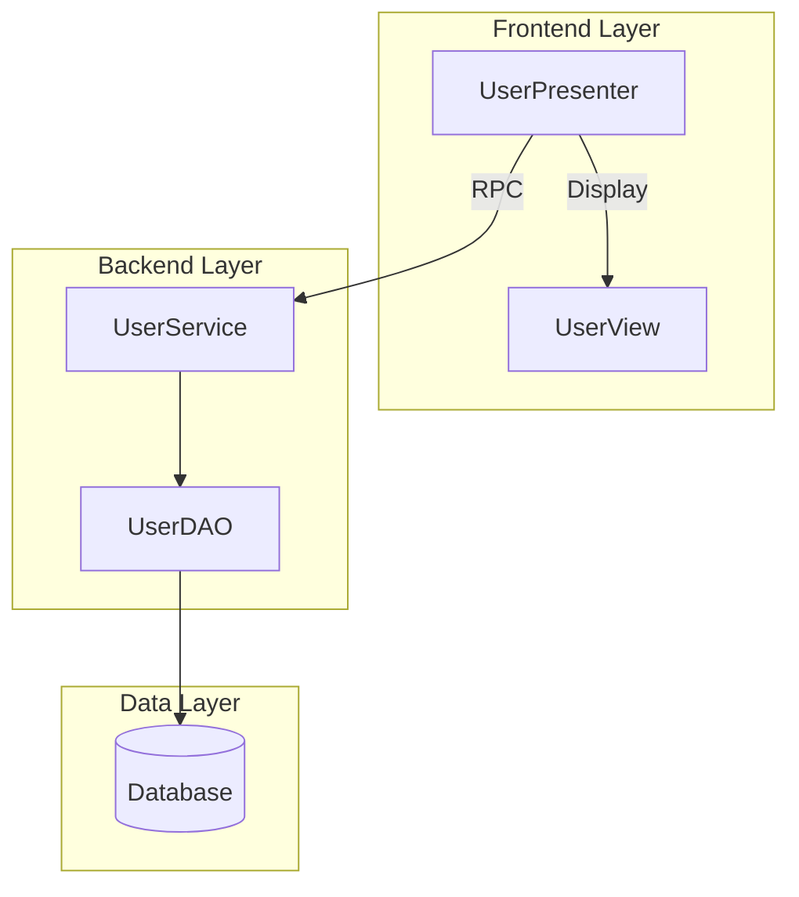
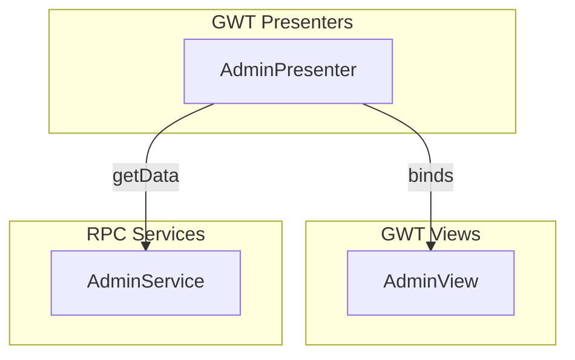

# CLAUDE.md

This file provides guidance to Claude Code (claude.ai/code) when working with code in this repository.

## Project Overview

GEMINI Code Analysis and PRD Generator - A Python-based pipeline that analyzes Java/JSP/GWT/JavaScript codebases, extracts structured information, indexes artifacts in Weaviate vector database, and generates Product Requirements Documents (PRDs) using AI (Ollama/GEMINI).

The project integrates with GitHub Spec Kit for spec-driven development workflows.

## Implementation Status

**Current Status**: ✅ **PRODUCTION READY** - All core features implemented and tested

### Completed Features

- ✅ **Phase 1-2**: Setup & Foundation - Complete project structure, configuration, models
- ✅ **Phase 3**: US1 Discover - Maven project discovery, file classification
- ✅ **Phase 4**: US2 Extract - AI semantic extraction with Ollama
- ✅ **Phase 5**: US3 Index - Weaviate vector database integration
- ✅ **Phase 6**: US4 Status - Health monitoring and statistics
- ✅ **Phase 7**: E2E Testing - Full pipeline integration tests
- ✅ **GWT Support**: Complete GWT extraction and PRD generation (84.9% coverage)
- ✅ **Diagram Generation**: Auto-generate architecture diagrams in Mermaid format (88-91% test coverage)

### Test Results

- **Unit Tests**: 497 passing (including 14 GWT-specific tests, 56 diagram tests)
- **Coverage**: 46% overall (91% mermaid_renderer, 88% diagram_generator, 70% frontend_analyzer, 94% in critical modules)
- **E2E Tests**: Full pipeline verified working
- **Production Test**: Successfully indexed 539-file codebase (cuco-ui-admin)
- **GWT Tests**: 14 comprehensive unit tests for GWT artifact loading and conversion
- **Diagram Tests**: 56 comprehensive tests (30 renderer + 26 generator)

### Known Limitations

- Indexing is not fully idempotent (re-indexing creates duplicates - use with caution)
- CLI command coverage is 0% (requires integration test updates)
- Some TDD-style tests have import errors and need API updates

## Architecture

### Core Pipeline Stages

The system operates through six main CLI stages (implemented as subcommands):

1. **discover** - Recursively scans `JAVA_SOURCE_DIR` for source files (.java, .jsp, .js, .xml, config files)
2. **extract** - Parses discovered files into structured artifacts (services, DAOs, endpoints, forms, GWT modules, DB schemas, iBATIS statements)
3. **index** - Generates vector embeddings and stores artifacts in Weaviate with project/type partitioning
4. **search** - Natural language semantic search over indexed artifacts
5. **prd** - Generates PRDs and requirements documents using Ollama LLM from indexed artifacts
6. **diagram** - Auto-generates architecture diagrams (component, GWT MVP) in Mermaid format from analyzed artifacts

### Key Artifact Types

The extractor creates typed artifacts stored in Weaviate:
- **Backend**: `DaoCall`, `IbatisStatement`, `BackendDoc`, `DbTable`, `GwtEndpoint`
- **Frontend**: `JspForm`, `GwtModule`, `GwtUiBinder`, `GwtActivityPlace`, `JsArtifact`

Each artifact includes: canonical ID, source path, language/framework type, and domain-specific metadata (endpoints, DTOs, DB schemas, form fields, navigation targets).

### External Dependencies

- **Weaviate** - Vector database running in Docker (port 8080), configured per OS (macOS/Ubuntu)
- **Ollama** - Local LLM service (port 11434) for embeddings and PRD generation
- **Spec Kit** - GitHub's spec-driven development toolkit integration via `.claude/` and `.specify/` directories

## Common Commands

### Environment Setup

```bash
# Create Python virtual environment
python -m venv .venv
source .venv/bin/activate  # On Windows: .venv\Scripts\activate

# Install dependencies
pip install -r requirements.txt

# Install package in development mode
pip install -e .

# Set required environment variable in .env
JAVA_SOURCE_DIR=/path/to/java/source/root

# Start Ollama (required before Weaviate)
ollama serve

# Pull the required model
ollama pull gemma3:12b

# Start Weaviate with OS auto-detection
./docker-weaviate.sh start

# Or force specific OS configuration
./docker-weaviate.sh start macos
./docker-weaviate.sh start ubuntu

# Check service status
./docker-weaviate.sh status
```

### Pipeline Execution

```bash
# Run CLI commands using Python module
python -m codeindex discover --source-dir /path/to/java/source --output ./output/discovery-inventory.jsonl
python -m codeindex extract --inventory ./output/discovery-inventory.jsonl --output ./output/extraction-results.jsonl
python -m codeindex index --inventory ./output/discovery-inventory.jsonl --extraction ./output/extraction-results.jsonl
python -m codeindex search "database access"
python -m codeindex status

# Or use installed command (after pip install -e .)
codeindex discover --source-dir /path/to/java/source
codeindex extract --inventory ./output/discovery-inventory.jsonl
codeindex index --inventory ./output/discovery-inventory.jsonl --extraction ./output/extraction-results.jsonl
codeindex search "database access"
codeindex status

# Project-specific operations
codeindex discover --source-dir /path/to/project --project myproject
codeindex status --project myproject
codeindex search "user authentication" --project myproject

# Run full pipeline using convenience script
./run.sh
# This runs: discover → extract → index → status
```

### Weaviate Management

```bash
# Docker Compose operations (OS-aware)
./docker-weaviate.sh start     # Start container
./docker-weaviate.sh stop      # Stop container
./docker-weaviate.sh restart   # Restart container
./docker-weaviate.sh logs      # View logs
./docker-weaviate.sh clean     # Remove all data (confirmation required)

# View indexed statistics and diagnostics
./weaviate_stats.py
# Shows: object counts by class, projects, sample paths, search tests
```

### Testing

```bash
# Run all tests
pytest

# Run specific test suites
pytest tests/unit/
pytest tests/integration/

# Run individual test files
pytest tests/unit/test_discovery.py
pytest tests/unit/test_extraction.py
pytest tests/unit/test_prd_generation.py
pytest tests/integration/test_indexing.py
pytest tests/integration/test_search.py
```

### Spec Kit Integration

```bash
# Initialize Spec Kit (already done)
specify init . --ai claude

# Core Spec Kit workflow commands
/speckit.constitution  # Define project principles
/speckit.specify       # Create feature specifications
/speckit.plan          # Generate implementation plans
/speckit.tasks         # Break down into actionable tasks
/speckit.implement     # Execute implementation

# Enhancement commands
/speckit.clarify       # Ask clarifying questions (before planning)
/speckit.analyze       # Check cross-artifact consistency (after tasks)
/speckit.checklist     # Generate validation checklists
/speckit.taskstoissues # Convert tasks to GitHub issues
```

### GWT Application Analysis

**Full support for Google Web Toolkit (GWT) applications** with specialized analyzers.

#### GWT Discovery

```bash
# Discover GWT application
codeindex discover --source-dir /path/to/gwt-app --project myapp

# Check GWT artifact detection
grep "gwt_" output/discovery-inventory.jsonl

# Expected artifact types:
# - gwt_ui_binder: *.ui.xml templates
# - gwt_module: *.gwt.xml descriptors
# - java_source: Presenters, Views, DTOs, Servlets
```

#### GWT Extraction

```bash
# Extract with GWT analyzers (includes AI semantic analysis)
codeindex extract --inventory output/discovery-inventory.jsonl \
  --output output/extraction-results.jsonl

# Faster extraction without AI (structural analysis only)
codeindex extract --skip-ai --inventory output/discovery-inventory.jsonl

# Monitor extraction progress
tail -f output/extraction-results.jsonl | jq '.gwt_role'
```

#### GWT-Specific Searches

```bash
# Find presenters
codeindex search "presenter" --project myapp

# Find form fields
codeindex search "form validation" --project myapp

# Find RPC services
codeindex search "remote service" --project myapp

# Find navigation targets
codeindex search "navigation" --project myapp
```

#### GWT Artifact Types Detected

The system recognizes these GWT patterns:

| Pattern | Type | Analyzer |
|---------|------|----------|
| `*Presenter.java` | Presenter | GwtPresenterAnalyzer |
| `*View.java` | View | GwtViewAnalyzer |
| `*DTO.java` (in shared) | DTO | GwtModelAnalyzer |
| `*ServletImpl.java` | RPC Servlet | GwtRpcAnalyzer |
| `*.ui.xml` | UiBinder | GwtUiBinderParser |
| `*.gwt.xml` | GWT Module | XML Parser |

#### GWT Metadata Extracted

**Presenter Analysis**:
- View interface binding (Display pattern, separate interface, naming convention)
- Event handlers (ClickHandler, ChangeHandler, etc.) with widget getters
- Navigation targets (Place/Activity navigation)
- RPC service calls with method names
- Confidence scores for MVP pattern detection

**View Analysis**:
- Component type (Composite, Widget, Panel, PopupPanel)
- @UiField widgets with types
- UiBinder template path
- Event handler registrations

**DTO Analysis**:
- Field definitions with types
- Validation rules (@NotNull, @Size, @Pattern, @Email, etc.)
- Serialization markers (IsSerializable, Serializable)
- Nested DTO references
- Inner class definitions

**UiBinder Template Analysis**:
- Form field widgets (TextBox, ListBox, CheckBox, etc.)
- Field labels (via heuristics: Display interface, naming, layout)
- ListBox options
- UI structure

**RPC Servlet Analysis**:
- Service method signatures
- Async interface name
- RemoteServiceServlet inheritance
- Method parameters and return types

#### GWT PRD Generation

**NEW**: Generate comprehensive PRDs from GWT metadata with 84.9% coverage.

```bash
# Generate frontend PRD with GWT components
codeindex prd frontend --output-dir ./output/gwt-validation

# The PRD will include:
# - 40 Presenters with event handlers and RPC calls
# - 30 Views with UI field bindings
# - 32 UiBinder forms with field details
# - Complete GWT Application Components section
# - GWT Presenters and Views tables with details

# Check PRD output
cat output/gwt-validation/prd/frontend_prd.md

# Verify coverage
python3 validate_t083.py
# Expected: >80% coverage (currently 84.9%)
```

**PRD Content for GWT**:
- **GWT Presenters Section**: Table of all presenters with event handler counts, RPC call counts, and navigation targets
- **Presenter Details**: Up to 10 presenters with full event handlers, RPC service calls, and navigation targets
- **GWT Views Section**: Table of all views with UI field counts and source files
- **View Details**: Up to 10 views with complete UI field bindings

#### GWT Validation Testing

```bash
# Run GWT-specific tests
pytest tests/unit/test_gwt_frontend_methods.py -v
pytest tests/integration/test_gwt_prd_generation.py -v
pytest tests/integration/test_gwt_weaviate_simple.py -v
pytest tests/unit/test_classifier.py::TestGwtClassification -v

# Check test coverage (52 GWT tests total)
pytest tests/ -k gwt -v --tb=short

# Run T083 PRD coverage validation
python3 validate_t083.py
```

#### GWT Troubleshooting

**Problem: UiBinder files not analyzed**
```bash
# Check if files were discovered
grep "gwt_ui_binder" output/discovery-inventory.jsonl

# Check extraction log for errors
grep -A5 "ui.xml" output/extraction-results.jsonl
grep "ERROR.*UiBinder" extraction.log

# Verify namespace in XML
grep "urn:ui:com.google.gwt.uibinder" path/to/file.ui.xml
```

**Problem: DTOs not recognized**
```bash
# Check if DTO is in shared package
ls -la src/main/java/*/shared/*DTO.java

# Or check for serialization markers
grep -E "IsSerializable|implements Serializable" path/to/DTO.java

# DTOs need either:
# 1. Be in .shared. package, OR
# 2. Have serialization markers in content
```

**Problem: Presenter-View binding not detected**
```bash
# Check MVP pattern in code
# Expected patterns:
# 1. Inner Display interface (90% confidence)
# 2. Separate view interface (85% confidence)
# 3. Naming convention: FooPresenter + FooView (70% confidence)

# Verify presenter has view reference
grep -A10 "class.*Presenter" path/to/Presenter.java | grep -i "display\|view"
```

**Problem: GWT components not in PRD**
```bash
# Verify extraction file exists and has GWT artifacts
ls -lh output/gwt-validation/extraction-results.jsonl
grep -c "gwt_role.*presenter" output/gwt-validation/extraction-results.jsonl

# Check if frontend analyzer processed GWT artifacts
grep "Processed.*GWT components" prd_generation.log

# Verify output files exist
ls -la output/gwt-validation/frontend/components/*.json
ls -la output/gwt-validation/frontend/forms/*.json

# Test GWT artifact loading manually
python3 -c "
from pathlib import Path
from codeindex.services.frontend_analyzer import FrontendAnalyzer
from codeindex.services.ollama_client import OllamaClient

analyzer = FrontendAnalyzer(
    ollama_client=OllamaClient(),
    source_dir=Path('.'),
    output_dir=Path('./output/gwt-validation')
)

counts = analyzer.process_gwt_artifacts(
    Path('./output/gwt-validation/extraction-results.jsonl')
)
print(f'Processed: {counts}')
"
```

**Problem: Low GWT PRD coverage (<80%)**
```bash
# Run coverage validation
python3 validate_t083.py

# Check what's documented vs extracted
grep -c "gwt_role" output/gwt-validation/extraction-results.jsonl
wc -l output/gwt-validation/frontend/components/*.json

# Common causes:
# 1. UiBinder without form fields (skipped correctly)
# 2. View files without UI fields
# 3. extraction-results.jsonl missing summary line
```

### Architecture Diagram Generation

**NEW**: Auto-generate visual architecture diagrams from analyzed codebase artifacts in Mermaid format (GitHub/GitLab compatible).

#### Diagram Types

**Component Architecture Diagram**:
- Frontend Layer: Presenters, Views, Forms
- Backend Layer: Services, DAOs
- Data Layer: Database
- Shows dependencies and data flow

**GWT MVP Diagram**:
- GWT Presenters with event handlers and RPC calls
- GWT Views with UI fields
- Presenter-View bindings
- RPC Service connections

#### Generate Diagrams

```bash
# Generate component architecture diagram
codeindex diagram component --output ./output/gwt-validation --format mermaid

# Generate GWT MVP architecture diagram
codeindex diagram gwt \
  --extraction-file ./output/gwt-validation/extraction-results.jsonl \
  --output ./output/gwt-validation \
  --format mermaid

# Generate all available diagrams
codeindex diagram all \
  --extraction-file ./output/gwt-validation/extraction-results.jsonl \
  --output ./output/gwt-validation \
  --format mermaid

# Open diagram in browser (Mermaid Live Editor)
codeindex diagram component --output ./output/gwt-validation --open
```

#### Diagram Options

```bash
--project TEXT          Project name filter (optional)
--output PATH           Output directory (default: ./output)
--format TEXT           Output format: mermaid|plantuml|d2|dot (default: mermaid)
--style TEXT            Diagram style: default|detailed|minimal (default: default)
--depth INTEGER         Dependency depth to include (default: 3)
--open                  Open generated diagram in browser/viewer
```

#### Generated Output Structure

```
output/gwt-validation/diagrams/
├── component/
│   └── architecture.mmd          # Component architecture diagram
├── gwt/
│   └── mvp-overview.mmd          # GWT MVP architecture diagram
└── README.md                      # Viewing instructions
```

#### Viewing Diagrams

**In GitHub/GitLab**:
- Mermaid diagrams render automatically in markdown files
- Simply include in your documentation with:
  ```markdown
  ```mermaid
  graph TB
      A[Presenter] --> B[View]
  ```
  ```

**In VS Code**:
- Install "Markdown Preview Mermaid Support" extension
- Preview diagrams directly in editor

**Online**:
- Paste diagram content at [Mermaid Live Editor](https://mermaid.live)
- Use `--open` flag to open automatically

**CLI Tool**:
```bash
# Install mermaid-cli
npm install -g @mermaid-js/mermaid-cli

# Convert to SVG
mmdc -i output/gwt-validation/diagrams/component/architecture.mmd -o architecture.svg

# Convert to PNG
mmdc -i output/gwt-validation/diagrams/gwt/mvp-overview.mmd -o mvp-overview.png
```

#### Diagram Features

**Smart Name Extraction**:
- Extracts correct component names from multiple sources (id, file_path, entities)
- Handles missing or incorrect names gracefully
- Sanitizes special characters for Mermaid syntax

**Automatic Connections**:
- Presenter-View bindings based on naming conventions
- Service-DAO relationships
- DAO-Database connections
- RPC service calls from presenters

**Diagram Limits**:
- Limits to 10-15 components per category to prevent overwhelming diagrams
- Shows most important components first
- Focuses on high-level architecture overview

#### Example Diagram Output

**Component Diagram**:


**GWT MVP Diagram**:


#### Testing Diagram Generation

```bash
# Run diagram generator tests
pytest tests/unit/test_diagram_generator.py -v
pytest tests/unit/test_mermaid_renderer.py -v

# Run all diagram tests (56 tests)
pytest tests/unit/test_diagram_generator.py tests/unit/test_mermaid_renderer.py -v

# Expected results:
# - test_diagram_generator.py: 26 tests, 88% coverage
# - test_mermaid_renderer.py: 30 tests, 91% coverage

# Verify mmdc works with generated diagrams
mmdc -i output/gwt-validation/diagrams/component/architecture.mmd -o /tmp/test.svg
mmdc -i output/gwt-validation/diagrams/gwt/mvp-overview.mmd -o /tmp/test.png
```

#### Diagram Troubleshooting

**Problem: "UnknownDiagramError: No diagram type detected" from mmdc**

This was fixed in commit 54cb593. The .mmd files now contain pure Mermaid syntax (starting with `graph TB`) instead of markdown-wrapped code fences.

```bash
# Verify .mmd file format (should start with "graph TB", NOT "```mermaid")
head -n 1 output/gwt-validation/diagrams/component/architecture.mmd
# Expected: graph TB

# If you see ```mermaid, regenerate diagrams with latest code
codeindex diagram all --output ./output/gwt-validation

# Verify mmdc works
mmdc -i output/gwt-validation/diagrams/component/architecture.mmd -o /tmp/test.svg
ls -lh /tmp/test.svg  # Should show ~28KB SVG file
```

**Problem: Diagram missing components**

```bash
# Check extraction file has artifacts
grep -c "gwt_role" output/gwt-validation/extraction-results.jsonl

# Verify components are in frontend output
ls -la output/gwt-validation/frontend/components/*.json

# Regenerate with verbose logging
codeindex diagram all --output ./output/gwt-validation -v
```

**Problem: Diagram too large or cluttered**

```bash
# Use minimal style
codeindex diagram component --style minimal

# Reduce depth
codeindex diagram component --depth 2

# Filter by project
codeindex diagram component --project myapp
```

## Development Notes

### Configuration

All configuration is centralized but follows this priority:
1. CLI arguments (highest)
2. Environment variables
3. `.env` file (gitignored, copy from `.env.example`)
4. Defaults in `src/codeindex/utils/config.py` (lowest)

Critical environment variables:
- `JAVA_SOURCE_DIR` - Root of source tree to analyze (required)
- `WEAVIATE_URL` - Weaviate endpoint (default: http://localhost:8080)
- `OLLAMA_URL` - Ollama endpoint (default: http://localhost:11434)
- `OLLAMA_MODEL_NAME` - Model to use (default: gemma3:12b)
- `MAX_CONCURRENT_AI_CALLS` - Concurrent Ollama requests (default: 10)
- `BATCH_SIZE` - Weaviate batch size (default: 50)
- `LOG_LEVEL` - Logging verbosity (DEBUG/INFO/WARNING/ERROR)
- `OUTPUT_DIR` - Directory for intermediate files (default: ./data)

### OS-Specific Behavior

The project auto-detects macOS vs Ubuntu/Linux and uses appropriate Docker Compose files:
- `docker-compose.macos.yml` - macOS configuration
- `docker-compose.ubuntu.yml` - Ubuntu/Linux configuration
- `docker-compose.yml` - Fallback/generic configuration

Weaviate uses `network_mode: host` to access local Ollama at `127.0.0.1:11434` (avoids IPv6 resolution issues).

### Project Structure Notes

- **src/codeindex/** - Main CLI application package
  - **cli/** - Command implementations (discover, extract, index, search, status)
  - **models/** - Data models (Project, CodeArtifact, DiscoveryInventory, ExtractionResult)
  - **services/** - Business logic (discovery, extraction, indexing, Maven parsing, Weaviate operations, Ollama client)
  - **parsers/** - Language-specific parsers (Java, JSP, XML, SQL)
  - **schemas/** - Weaviate schema definitions
  - **utils/** - Utilities (config, logging, retry, progress, locking)
- **tests/** - Unit and integration tests
  - **fixtures/** - Test data (sample Java/JSP/XML files, POMs)
  - **unit/** - Unit tests for parsers, services, models
  - **integration/** - Integration tests with Weaviate and Ollama
  - **e2e/** - End-to-end pipeline tests
- **archive/** - Old/deprecated code
- **data/** - Runtime data directory (gitignored)
- **output/** - Generated PRDs and artifacts (gitignored)
- **specs/** - Spec Kit feature specifications
  - **001-java-codebase-indexer/** - Current feature spec, plan, tasks, data model, contracts, quickstart
- **weaviate-data/** - Persistent vector database storage (gitignored)
- **.claude/** - Claude Code slash commands
- **.specify/** - Spec Kit templates and memory
- **Iterations/** - Development iteration documentation

### Key Scripts

- `run.sh` - Convenience wrapper to run full pipeline with project name parameter
- `docker-weaviate.sh` - Comprehensive Weaviate Docker management (start/stop/clean/status/logs)
- `weaviate_stats.py` - Diagnostic tool showing indexed content with rich terminal output
- `setup_venv.sh` - Python virtual environment setup

### Weaviate Container Naming

Container uses name `weaviate-i19` (iteration 19), check `docker-weaviate.sh` status command for exact container grep pattern.

### Multi-Project Support

The system supports multiple projects in a shared Weaviate instance:
- Artifacts are tagged by `project` field
- Searches can filter by project
- Indexing is idempotent (re-indexing updates/upserts rather than duplicating)

### PRD Generation

Generated PRDs follow product requirements best practices:
- Objectives and stakeholders
- User stories
- Functional/non-functional requirements
- Out of scope items
- Structured for Spec Kit compatibility (`specs/<feature-id>/prd.md`)

Supports separate backend and frontend requirement generation via CLI flags.

## Integration with Spec Kit

Generated PRDs are designed to be consumed by Spec Kit:
1. Run pipeline to extract artifacts and generate PRDs
2. Place PRDs in `specs/<feature-id>/prd.md`
3. Use `/speckit.specify` to transform PRDs into specs
4. Use `/speckit.plan` and `/speckit.tasks` for implementation planning
5. Domain labels on artifacts help with feature breakdown

## Troubleshooting

### Services Not Running

```bash
# Check Ollama
curl -s http://localhost:11434/api/tags

# Check Weaviate
curl -s http://localhost:8080/v1/meta

# Use diagnostic script
./docker-weaviate.sh status
```

### Empty Search Results

```bash
# Check what's actually indexed
./weaviate_stats.py

# Verify project name matches
# Check that indexing completed without errors
```

### Container Issues

```bash
# View logs
./docker-weaviate.sh logs

# Clean restart
./docker-weaviate.sh clean
./docker-weaviate.sh start
```

### Missing src/main.py

Note: The `run.sh` script expects `src/main.py` but the src directory may be empty. Check if:
- Code is at project root level
- Code is in `archive/` directory
- Project structure is being reorganized


## Active Technologies
- Python 3.8+ (minimum version for type hints and modern async support) (001-java-codebase-indexer)
- Python 3.8+ (minimum version for type hints and async support, consistent with Feature 001) (002-prd-document-generation)
- Python 3.8+ (existing codebase requirement) (001-gwt-prd-support)
- Weaviate vector database (existing - adds GWT-specific metadata fields) (001-gwt-prd-support)
- Python 3.8+ (minimum for type hints and async support, consistent with Feature 001) (004-maven-dependency-resolution)
- Weaviate vector database (existing) - extended with DtoArtifact schema (004-maven-dependency-resolution)

## Recent Changes
- 001-java-codebase-indexer: Added Python 3.8+ (minimum version for type hints and modern async support)
- 003-architecture-diagram-generation: Added auto-generated Mermaid diagrams for component and GWT MVP architecture
  - Commit 54cb593: Fixed .mmd format to use pure Mermaid syntax (removed markdown code fences) for mermaid-cli compatibility
  - Commit abe0e46: Added comprehensive documentation to main README
  - All 56 diagram tests passing with 88-91% coverage
  - Verified mmdc (mermaid-cli) successfully converts .mmd files to SVG/PNG
