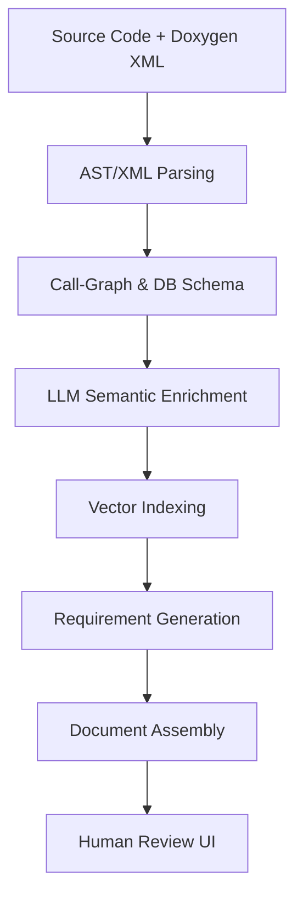
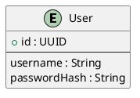

# Iteration 6: New implementation

**Goal:**  
To build a fully automated pipeline that transforms Java source code into a structured Requirements Specification document, we implement a multi-stage process combining static analysis, AI-driven semantic enrichment, and traceable documentation generation. This solution addresses both technical implementation and compliance with software engineering standards.

**Constraint:**  
The application must run from the `iteration6/` directory and use **Python** (not Java).

---

## Directory Structure

.
├── config/
│   └── app.yaml
├── data/
│   ├── doxygen_xml/
│   ├── java_source/
│   └── chromadb/
├── output/
├── src/
│   ├── doxygen_parser.py
│   ├── embedder.py
│   ├── chromadb_connector.py
│   ├── clustering_engine.py
│   ├── requirement_generator.py
│   └── main.py
├── requirements.txt
└── .env

### Pipeline Architecture


---

### 1. Implementation Guide (`howto.md`)

#### Prerequisites
```bash
# Core dependencies
python==3.11
gitpython==3.1.40
java-parser==1.1.0
langchain==0.1.14
chromadb==0.4.24
```

#### Step-by-Step Setup

**1. Source Ingestion**
```python
from git import Repo
import xml.etree.ElementTree as ET

# Clone repository
Repo.clone_from('https://github.com/project/repo.git', 'source_code')

# Load Doxygen XML
tree = ET.parse('docs/xml/index.xml')
root = tree.getroot()
```

**2. AST Processing with JavaParser**
```java
// Using JavaParser's Visitor pattern
public class MethodVisitor extends VoidVisitorWithDefaults {
    @Override
    public void visit(MethodDeclaration method, Void arg) {
        System.out.println("Method: " + method.getName());
        method.getParameters().forEach(p -> 
            System.out.println(" Param: " + p.toString()));
    }
}
```

**3. Call Graph Generation**
```bash
# Generate call hierarchy
jpapper analyze --target-class com.example.Service --output graph.dot
dot -Tpng graph.dot -o callgraph.png
```

**4. LLM-Powered Requirement Extraction**
```python
from langchain.prompts import ChatPromptTemplate

requirement_template = """
Analyze the following Java method and generate user story:
Method: {method_name}
Parameters: {params}
Code: {code_snippet}

Output format:
| Section    | Content       |
|------------|---------------|
| Feature ID | FR-{autogen}  |
| Purpose    |  |
"""
```

### 2. Requirements Document Structure

**2.1 Functional Requirements**
```markdown
| Feature ID | Description                   | Source Class      |
|------------|-------------------------------|-------------------|
| FR-AUTH-01 | User authentication service   | AuthController.java [4] |
```

**2.5 Data Model (Auto-generated ERD)**


**2.8 Traceability Matrix**
```csv
RequirementID,SourceFile,Method,Type
FR-API-01,OrderService.java,createOrder(),REST Endpoint
```

### 3. Validation Workflow

**manual review**
