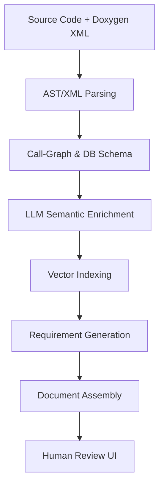
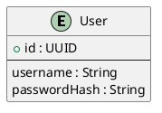

# Iteration 6: New implementation

**Goal:**  
To build a fully automated pipeline that transforms Java source code and an doxygen output into a structured Requirements Specification document, we implement a multi-stage process combining static analysis, AI-driven semantic enrichment, and traceable documentation generation. This solution addresses both technical implementation and compliance with software engineering standards.

**Constraint:**  
The application must run in 2 processes one main.py for doing the ingestion and using the doxygen output as ast and enricht all imnformation for later use extract. And a 2nd step which is repeatable to extract requirements rec specs and data structures named requirement_generator.py

---

## Directory Structure

.
├── config/
│   └── app.yaml
├── data/
│   ├── doxygen_xml/
│   ├── java_source/
│   └── chromadb/
├── output/
├── src/
│   ├── doxygen_parser.py
│   ├── embedder.py
│   ├── chromadb_connector.py
│   ├── clustering_engine.py
│   ├── requirement_generator.py
│   └── main.py
├── requirements.txt
└── .env

### Pipeline Architecture


---

### 1. Implementation Guide (`howto.md`)

#### Prerequisites
```bash
# Core dependencies
python==3.11
gitpython==3.1.40
java-parser==1.1.0
langchain==0.1.14
chromadb==0.4.24
```

#### Step-by-Step Setup

**1. Source Ingestion**

start from an directory using .env named JAVA_SOURCE_DIR embed all source files into chromadb jsp xml sql and java files 

**2. AST Processing with doxygen**

use doxygen ouput to create am abstract syntax tree and substitute missing information from sourcecode 
upload this information to chromadb for futher use

**3. Call Graph Generation**

use doxygen output especially the class hierachy to build an call graph 
upload this information to chromadb for futher use

**4. LLM-Powered Requirement Extraction**
```python
from langchain.prompts import ChatPromptTemplate

requirement_template = """
Analyze the following Java method and generate user story:
Method: {method_name}
Parameters: {params}
Code: {code_snippet}

Output format:
| Section    | Content       |
|------------|---------------|
| Feature ID | FR-{autogen}  |
| Purpose    |  |
"""
```

### 2. Requirements Document Structure

**2.1 Functional Requirements**
```markdown
| Feature ID | Description                   | Source Class      |
|------------|-------------------------------|-------------------|
| FR-AUTH-01 | User authentication service   | AuthController.java [4] |
```

**2.5 Data Model (Auto-generated ERD)**


**2.8 Traceability Matrix**
```csv
RequirementID,SourceFile,Method,Type
FR-API-01,OrderService.java,createOrder(),REST Endpoint
```

### 3. Validation Workflow

**manual review**