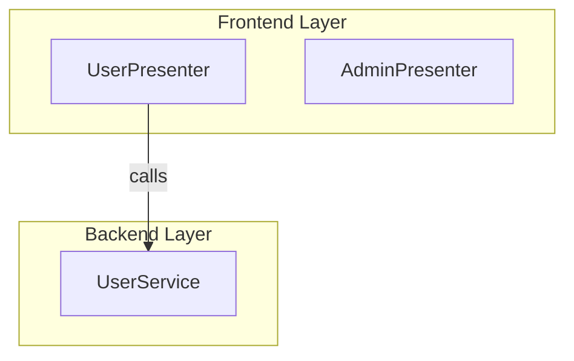
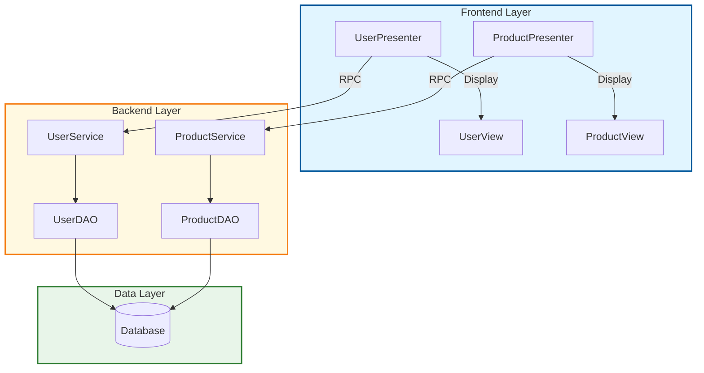
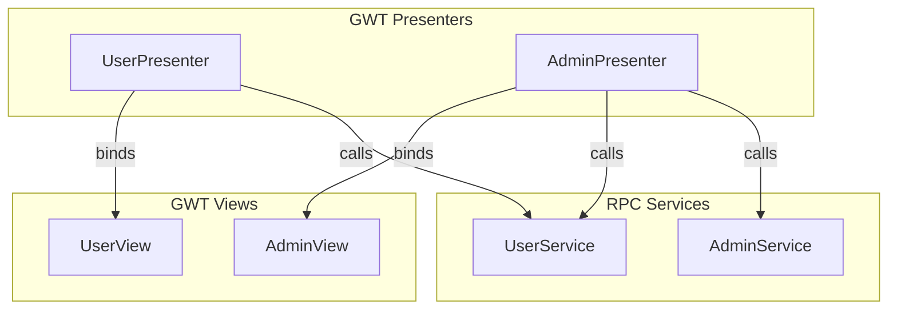

# Quickstart Guide: Architecture Diagram Generation

**Feature**: 003-architecture-diagram-generation
**Date**: 2025-12-15
**Status**: ✅ Production Ready

## Overview

This guide walks you through using the Architecture Diagram Generation feature to create visual representations of your system architecture. You'll learn how to generate component diagrams showing system structure, GWT MVP diagrams showing presenter-view relationships, and how to view diagrams in multiple formats.

**What you'll create**:
- **Component Architecture Diagrams**: Frontend, Backend, and Data layers with relationships
- **GWT MVP Diagrams**: Presenter-view bindings, event handlers, and RPC service calls
- **Multiple Formats**: View in GitHub, VS Code, online editor, or export to SVG/PNG

**Time to first diagram**: 2 minutes

---

## Prerequisites

Before you begin, ensure you have:

### 1. Feature 001 Extraction Completed

Your codebase must be analyzed and extracted:

```bash
# Run Feature 001 pipeline if not already done
codeindex discover --source-dir /path/to/java/source --project myapp
codeindex extract --project myapp

# Verify extraction results exist
ls -lh output/myapp/extraction-results.jsonl
# Should show extraction results file (e.g., 500KB)
```

**Why needed**: Diagram generation reads component data from extraction results. Without extraction, there's no data to visualize.

### 2. Python Environment

```bash
# Activate virtual environment
source .venv/bin/activate  # On Windows: .venv\Scripts\activate

# Verify codeindex CLI is installed
codeindex --version

# Install/update if needed
pip install -e .
```

### 3. Optional: mermaid-cli for SVG/PNG Export

If you want to convert diagrams to SVG or PNG:

```bash
# Install mermaid-cli globally
npm install -g @mermaid-js/mermaid-cli

# Verify installation
mmdc --version
# Should show: @mermaid-js/mermaid-cli version X.X.X
```

**Note**: Not required for viewing in GitHub, VS Code, or online editor.

---

## Quick Start (2 Minutes)

### Generate All Diagrams

Generate both component and GWT diagrams with one command:

```bash
codeindex diagram all --project myapp
```

**Output**:
```
Generating diagrams for project: myapp
✓ Component architecture diagram created: output/myapp/diagrams/component/architecture.mmd (5.2KB)
✓ GWT MVP diagram created: output/myapp/diagrams/gwt/mvp-overview.mmd (4.8KB)
✓ README created: output/myapp/diagrams/README.md
✓ 2 diagrams generated in 3.2 seconds
```

**What's created**:
```
output/myapp/diagrams/
├── README.md                           # Viewing instructions
├── component/
│   └── architecture.mmd                # Component architecture diagram
└── gwt/
    └── mvp-overview.mmd                # GWT MVP diagram
```

### View in GitHub

1. Add diagram to your README or docs:

````markdown
# Architecture Overview


````

2. Or reference the .mmd file:

```markdown

```

3. Commit and push - diagram renders automatically on GitHub!

### View in VS Code

1. Install extension: **"Markdown Preview Mermaid Support"**
2. Open `.mmd` file
3. Press `Ctrl+Shift+V` (or `Cmd+Shift+V` on macOS)
4. Diagram previews instantly!

### View Online

1. Open [Mermaid Live Editor](https://mermaid.live)
2. Copy `.mmd` file contents
3. Paste into editor
4. View, edit, and export (SVG, PNG, PDF)

### Export to SVG/PNG

```bash
# Convert component diagram to SVG
mmdc -i output/myapp/diagrams/component/architecture.mmd -o architecture.svg

# Convert GWT diagram to PNG
mmdc -i output/myapp/diagrams/gwt/mvp-overview.mmd -o gwt-mvp.png

# Custom dimensions
mmdc -i architecture.mmd -o architecture.png -w 1920 -H 1080
```

---

## Diagram Types

### Component Architecture Diagram

Shows system-wide structure with frontend, backend, and data layers.

**Generate**:
```bash
codeindex diagram component --project myapp
```

**What it includes**:
- **Frontend Layer**: Presenters, Views, Forms
- **Backend Layer**: Services, DAOs
- **Data Layer**: Database
- **Relationships**: Presenter→View, Service→DAO, DAO→Database

**Example Output**:



**Color Scheme**:
- 🔵 **Frontend**: Blue (#e1f5ff)
- 🟡 **Backend**: Yellow (#fff9e1)
- 🟢 **Data**: Green (#e8f5e9)

**Use Cases**:
- System architecture documentation
- Onboarding new team members
- Technical presentations to stakeholders
- Planning refactoring or modernization
- Code review context

---

### GWT MVP Diagram

Shows GWT application structure with presenter-view relationships and RPC calls.

**Generate**:
```bash
codeindex diagram gwt --project myapp
```

**What it includes**:
- **GWT Presenters**: MVP pattern presenters with event handlers
- **GWT Views**: UI components with field bindings
- **RPC Services**: Backend services called by presenters
- **Relationships**: Presenter→View bindings, Presenter→RPC calls

**Example Output**:



**Use Cases**:
- Understanding GWT application structure
- Planning GWT to modern framework migration
- Identifying tightly-coupled components
- Documenting MVP pattern implementation
- Analyzing RPC service dependencies

---

## Advanced Usage

### Style Options

Control diagram complexity for different audiences:

#### Default Style (Documentation)

Balanced detail for general documentation:

```bash
codeindex diagram component --style default
```

Shows: Component names, relationships, color-coded layers

**Best for**: Technical documentation, README files, wiki pages

---

#### Minimal Style (Executives)

Simplified view for high-level overviews:

```bash
codeindex diagram component --style minimal
```

Shows: Essential components only, basic connections, minimal labels

**Best for**: Executive presentations, high-level overviews, project proposals

---

#### Detailed Style (Developers)

Rich metadata for technical deep-dives:

```bash
codeindex diagram gwt --style detailed
```

Shows: Component metadata (event counts, RPC counts, UI field counts), method names in connections

**Example node**:
```
UserPresenter<br/>3 events, 2 RPCs
```

**Best for**: Code reviews, technical analysis, debugging, planning refactoring

---

### Depth Control

Limit relationship depth for focused diagrams:

```bash
# Show only direct relationships (depth 1)
codeindex diagram component --depth 1

# Show relationships 2 levels deep (default: 3)
codeindex diagram component --depth 2
```

**Use case**: Focus on specific subsystem without clutter from distant dependencies.

---

### Custom Output Directory

Generate diagrams in specific location:

```bash
codeindex diagram all --output ./docs/architecture/

# Output location:
# ./docs/architecture/component/architecture.mmd
# ./docs/architecture/gwt/mvp-overview.mmd
```

**Use case**: Integrate directly into documentation structure or specs directory.

---

### Specify Extraction File

Use specific extraction results:

```bash
codeindex diagram all \
  --extraction-file ./output/myapp/extraction-results.jsonl \
  --output ./diagrams/
```

**Use case**: Generate diagrams from different extraction runs or project versions.

---

## Common Workflows

### Workflow 1: Documentation Pipeline

Generate diagrams as part of documentation workflow:

```bash
# 1. Extract latest code
codeindex extract --project myapp

# 2. Generate diagrams
codeindex diagram all --project myapp --style default

# 3. Copy to documentation
cp output/myapp/diagrams/component/architecture.mmd docs/architecture/
cp output/myapp/diagrams/gwt/mvp-overview.mmd docs/architecture/

# 4. Commit and push
git add docs/architecture/*.mmd
git commit -m "docs: update architecture diagrams"
git push
```

**Result**: Always-current architecture diagrams in your documentation.

---

### Workflow 2: Presentation Package

Create presentation-ready exports:

```bash
# 1. Generate detailed diagrams
codeindex diagram all --project myapp --style detailed

# 2. Export to PNG for slides
mmdc -i output/myapp/diagrams/component/architecture.mmd \
     -o presentation/architecture.png -w 1920 -H 1080

mmdc -i output/myapp/diagrams/gwt/mvp-overview.mmd \
     -o presentation/gwt-mvp.png -w 1920 -H 1080

# 3. Create minimal version for executive summary
codeindex diagram component --style minimal --output presentation/executive/
mmdc -i presentation/executive/component/architecture.mmd \
     -o presentation/executive/overview.png -w 1920 -H 1080
```

**Result**: Multiple diagram variants for different presentation contexts.

---

### Workflow 3: Spec Kit Integration

Integrate diagrams into Spec Kit feature documentation:

```bash
# 1. Extract and generate diagrams
codeindex extract --project myapp
codeindex diagram all --project myapp

# 2. Copy to feature spec directory
mkdir -p specs/myfeature/diagrams/
cp output/myapp/diagrams/component/architecture.mmd specs/myfeature/diagrams/
cp output/myapp/diagrams/gwt/mvp-overview.mmd specs/myfeature/diagrams/

# 3. Reference in spec.md
echo "See [Architecture Diagram](./diagrams/architecture.mmd)" >> specs/myfeature/spec.md

# 4. Run Spec Kit commands
/speckit.plan
```

**Result**: Architecture diagrams integrated into feature specifications.

---

### Workflow 4: CI/CD Integration

Automatically generate diagrams on code changes:

```yaml
# .github/workflows/diagrams.yml
name: Update Architecture Diagrams

on:
  push:
    branches: [main]
    paths:
      - 'src/**/*.java'

jobs:
  diagrams:
    runs-on: ubuntu-latest
    steps:
      - uses: actions/checkout@v3

      - name: Setup Python
        uses: actions/setup-python@v4
        with:
          python-version: '3.8'

      - name: Install codeindex
        run: pip install -e .

      - name: Extract code
        run: codeindex extract --project myapp

      - name: Generate diagrams
        run: codeindex diagram all --project myapp --output ./docs/diagrams/

      - name: Commit diagrams
        run: |
          git add docs/diagrams/
          git commit -m "chore: update architecture diagrams [skip ci]" || exit 0
          git push
```

**Result**: Architecture diagrams automatically updated on every code change.

---

## Troubleshooting

### Issue: "No extraction results found"

**Error**:
```
Error: Extraction file not found: output/myapp/extraction-results.jsonl
```

**Solution**:
```bash
# Run extraction first
codeindex discover --source-dir /path/to/source --project myapp
codeindex extract --project myapp

# Verify extraction results exist
ls -lh output/myapp/extraction-results.jsonl

# Then generate diagrams
codeindex diagram all --project myapp
```

---

### Issue: "Diagram file is empty or has few components"

**Cause**: Extraction may not have found many components.

**Solution**:
```bash
# Check extraction results
grep -c "gwt_role" output/myapp/extraction-results.jsonl
# Should show count of GWT components

grep -c "semantic_data" output/myapp/extraction-results.jsonl
# Should show count of components with semantic data

# If counts are low, re-run extraction with verbose logging
codeindex extract --project myapp -v
```

---

### Issue: "mmdc: UnknownDiagramError"

**Error**:
```
Error: UnknownDiagramError: No diagram type detected
```

**Cause**: Old version of diagrams with markdown code fences.

**Solution**:
```bash
# Verify .mmd file format (should start with "graph TB")
head -n 1 output/myapp/diagrams/component/architecture.mmd
# Expected: graph TB
# NOT:      ```mermaid

# If file has code fences, regenerate diagrams
codeindex diagram all --project myapp --output ./output/myapp/diagrams/

# Verify fix
head -n 1 output/myapp/diagrams/component/architecture.mmd

# Test conversion
mmdc -i output/myapp/diagrams/component/architecture.mmd -o /tmp/test.svg
```

---

### Issue: "Diagram too cluttered or hard to read"

**Solution 1: Use Minimal Style**
```bash
codeindex diagram component --style minimal
```

**Solution 2: Filter by Project**
```bash
# Generate diagrams for specific project only
codeindex diagram all --project specific-module
```

**Solution 3: Reduce Depth**
```bash
# Show only immediate relationships
codeindex diagram component --depth 1
```

---

### Issue: "Component names showing as 'Unknown'"

**Cause**: Extraction data missing component names.

**Solution**:
```bash
# Check extraction data quality
python3 -c "
import json
with open('output/myapp/extraction-results.jsonl') as f:
    for line in f:
        data = json.loads(line)
        print(f\"File: {data.get('file_path', 'unknown')}\")
        print(f\"Name: {data.get('name', 'missing')}\")
        print(f\"ID: {data.get('id', 'missing')}\")
        print('---')
" | head -n 50

# Re-run extraction if data quality is poor
codeindex extract --project myapp --force-refresh
```

---

## Tips and Best Practices

### 1. Generate Diagrams Regularly

Add to your development workflow:

```bash
# After significant code changes
codeindex extract --project myapp
codeindex diagram all --project myapp
```

**Benefit**: Always-current architecture documentation.

---

### 2. Use Different Styles for Different Audiences

```bash
# For executives
codeindex diagram component --style minimal --output presentation/executive/

# For documentation
codeindex diagram all --style default --output docs/architecture/

# For code reviews
codeindex diagram gwt --style detailed --output reviews/architecture/
```

**Benefit**: Appropriate detail level for each context.

---

### 3. Version Control Diagrams

```bash
# Commit .mmd files (not generated images)
git add output/myapp/diagrams/*.mmd
git commit -m "docs: update architecture diagrams"

# Generate images locally or in CI
mmdc -i architecture.mmd -o architecture.png
```

**Benefit**: Diagrams in version control, rendered images generated on-demand.

---

### 4. Combine with PRD Generation

```bash
# Generate comprehensive documentation
codeindex extract --project myapp
codeindex prd full --project myapp
codeindex diagram all --project myapp

# Copy to specs directory
cp output/myapp/diagrams/*.mmd specs/myapp/
cp output/myapp/prd/*.md specs/myapp/
```

**Benefit**: Visual diagrams + detailed PRDs = complete documentation.

---

### 5. Use Diagram Links in Documentation

```markdown
# System Architecture

Our system follows a three-tier architecture:


## GWT Frontend

The frontend is built with GWT using MVP pattern:


For detailed component relationships, see [spec.md](./spec.md).
```

**Benefit**: Visual context in written documentation.

---

## Next Steps

### Learn More

- **Spec Documentation**: [spec.md](./spec.md) - Complete feature specification
- **Task Breakdown**: [tasks.md](./tasks.md) - Implementation details
- **Implementation Plan**: [plan.md](./plan.md) - Technical design

### Related Features

- **Feature 001**: Java Codebase Indexer - Provides extraction data
- **Feature 002**: PRD Document Generation - Complementary documentation

### Advanced Features

- **Custom Extraction**: Modify extraction to capture additional component metadata
- **Custom Renderers**: Implement PlantUML, D2, or Graphviz renderers
- **Interactive Diagrams**: Export to HTML with clickable components

---

## Summary

You've learned how to:

✅ Generate component architecture diagrams
✅ Generate GWT MVP diagrams
✅ View diagrams in multiple formats (GitHub, VS Code, online, CLI)
✅ Export diagrams to SVG/PNG
✅ Use style variants for different audiences
✅ Integrate diagrams into documentation workflows
✅ Troubleshoot common issues

**Next**: Generate diagrams for your project and integrate into your documentation!

```bash
# Your first diagram in 30 seconds:
codeindex extract --project myproject
codeindex diagram all --project myproject
open output/myproject/diagrams/README.md
```

---

**Questions or Issues?**
- Check [CLAUDE.md](../../../CLAUDE.md) for detailed usage examples
- Check [README.md](../../../README.md) for architecture documentation
- Review [tasks.md](./tasks.md) for implementation details

**Happy Diagramming! 🎨📊**
