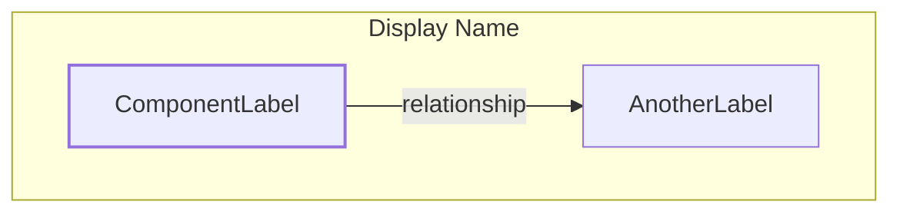
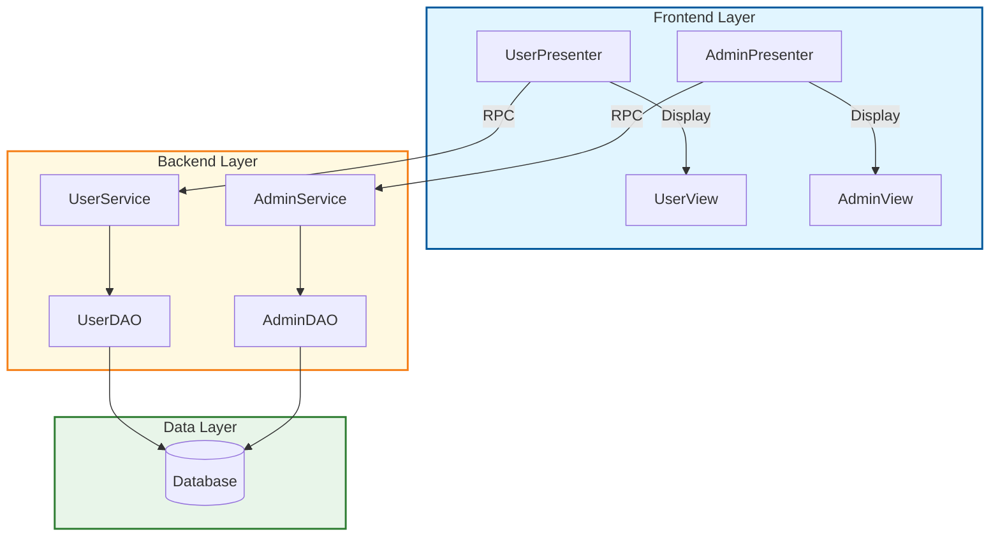
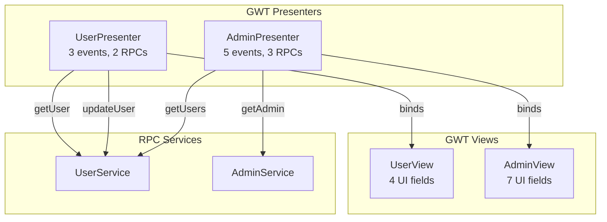

# Feature Specification: Architecture Diagram Generation

**Feature Branch**: `003-architecture-diagram-generation`
**Created**: 2025-12-15
**Status**: Completed
**Implementation Commits**: 56366fa, eef74aa, 4db9d07, 54cb593, abe0e46, a18d41a

## Overview

Auto-generate visual architecture diagrams in Mermaid format from analyzed codebase artifacts. This feature produces two types of diagrams: Component Architecture diagrams showing system-wide structure, and GWT MVP diagrams showing presenter-view relationships in GWT applications.

## Problem Statement

Developers and technical architects need visual representations of system architecture to:
- Understand component relationships and dependencies
- Document system structure for onboarding and knowledge transfer
- Communicate architecture decisions to stakeholders
- Plan modernization and refactoring efforts
- Maintain up-to-date architecture documentation

Manual diagram creation is time-consuming, error-prone, and quickly becomes outdated as code evolves. Existing tools either require manual maintenance or produce cluttered, unusable diagrams from large codebases.

## Goals

1. **Auto-generate accurate architecture diagrams** directly from extracted code artifacts
2. **Support multiple diagram types** (component architecture, GWT MVP relationships)
3. **Produce industry-standard Mermaid format** for maximum compatibility
4. **Enable multiple viewing options** (GitHub, VS Code, online editor, CLI conversion to SVG/PNG)
5. **Handle large codebases gracefully** with intelligent component limiting
6. **Integrate seamlessly** with existing discovery and extraction pipeline

## Non-Goals

- Real-time diagram updates during development
- Interactive diagram editing or manipulation
- Support for diagram formats beyond Mermaid (PlantUML, D2, Graphviz can be added later)
- Database schema diagrams (ER diagrams - different feature)
- Sequence diagrams or timing diagrams
- Custom styling or theming beyond provided styles (default, minimal, detailed)

## User Scenarios & Testing

### User Story 1 - Component Architecture Visualization (Priority: P0)

As a technical architect or senior developer, I need to visualize the high-level system architecture showing how presenters, views, services, DAOs, and database components connect so that I can understand the system structure and identify architectural issues.

**Why this priority**: Component architecture diagrams are the most requested visualization type. They provide the essential "big picture" view needed for understanding, documentation, and planning work.

**Independent Test**: Can be fully tested by running diagram generation on a project with extracted artifacts and verifying the output Mermaid file contains correct components and relationships.

**Acceptance Scenarios**:

1. **Given** a project with extracted presenters, views, services, and DAOs, **When** I run `codeindex diagram component`, **Then** a Mermaid diagram is generated showing all layers (Frontend, Backend, Data) with components organized in subgraphs
2. **Given** components with relationships (presenter-view, service-DAO, DAO-database), **When** the diagram is generated, **Then** connections are drawn showing data flow and dependencies with appropriate labels
3. **Given** a project with 50+ components, **When** generating a component diagram, **Then** the system limits to 10-15 most important components per layer to prevent cluttered diagrams
4. **Given** components with special characters in names, **When** creating diagram nodes, **Then** names are sanitized to be Mermaid-compatible while remaining readable
5. **Given** a generated .mmd file, **When** I use mermaid-cli (mmdc), **Then** the file successfully converts to SVG/PNG without errors

---

### User Story 2 - GWT MVP Relationship Visualization (Priority: P1)

As a GWT application developer or maintainer, I need to visualize presenter-view bindings, event handlers, and RPC service calls so that I can understand the MVP architecture and plan frontend modernization.

**Why this priority**: GWT applications have complex MVP patterns that are difficult to understand from code alone. Visualizing these relationships is essential for maintaining and migrating GWT applications.

**Independent Test**: Can be tested by running GWT diagram generation on a project with GWT artifacts and verifying presenter-view bindings and RPC connections are accurately represented.

**Acceptance Scenarios**:

1. **Given** extracted GWT presenters with view bindings, **When** I run `codeindex diagram gwt`, **Then** a diagram shows presenters and views in separate subgraphs with "binds" connections between matching pairs
2. **Given** presenters with RPC service calls, **When** generating a GWT diagram, **Then** RPC services are shown in a third subgraph with connections from presenters indicating service usage
3. **Given** presenters and views with metadata (event counts, RPC counts, UI field counts), **When** using detailed style, **Then** the diagram includes this metadata in node labels for richer context
4. **Given** a large GWT application with 30+ presenters, **When** generating the diagram, **Then** the system limits to 10 presenters and 10 views to maintain readability
5. **Given** presenter-view pairs with naming convention matching (UserPresenter/UserView), **When** generating connections, **Then** the system automatically infers bindings based on name matching

---

### User Story 3 - Multi-Format Output and Viewing (Priority: P2)

As a documentation author or team lead, I need to view generated diagrams in multiple formats (in-browser preview, GitHub markdown, VS Code, exported SVG/PNG) so that I can incorporate architecture documentation into various contexts.

**Why this priority**: Different stakeholders need different viewing options. Developers want GitHub/VS Code integration, managers want exported PNGs for presentations, and architects want editable online versions.

**Independent Test**: Can be tested by generating diagrams and successfully viewing/converting them using multiple tools (GitHub, VS Code with extensions, Mermaid Live Editor, mermaid-cli).

**Acceptance Scenarios**:

1. **Given** a generated .mmd file, **When** I view it on GitHub in a markdown file, **Then** the diagram renders automatically inline
2. **Given** a .mmd file opened in VS Code with Mermaid extension, **When** I open the preview pane, **Then** the diagram renders correctly
3. **Given** a .mmd file, **When** I paste contents into Mermaid Live Editor, **Then** the diagram renders and can be edited/exported
4. **Given** a .mmd file, **When** I run `mmdc -i diagram.mmd -o diagram.svg`, **Then** a valid SVG file is created without errors
5. **Given** generated diagrams in the output directory, **When** I open the README.md file, **Then** clear instructions explain all viewing options

---

### User Story 4 - Diagram Style Customization (Priority: P3)

As a user with different documentation needs, I need to control diagram complexity through style options (default, minimal, detailed) so that I can generate appropriate diagrams for different audiences.

**Why this priority**: One-size-fits-all diagrams don't work. Executives need simple overviews, developers need detailed technical views, and documentation needs balanced middle ground.

**Independent Test**: Can be tested by generating the same diagram with different style options and verifying output differences match expectations.

**Acceptance Scenarios**:

1. **Given** a project with components, **When** I generate a diagram with `--style default`, **Then** the diagram shows all components with basic relationships and color-coded layers
2. **Given** the same project, **When** I use `--style minimal`, **Then** the diagram shows only essential components with simplified labels and minimal decorations
3. **Given** the same project, **When** I use `--style detailed`, **Then** the diagram includes metadata like event counts, RPC counts, and UI field counts in node labels
4. **Given** a detailed-style GWT diagram, **When** viewing presenter nodes, **Then** labels show format like "UserPresenter<br/>3 events, 2 RPCs"
5. **Given** any style option, **When** the diagram is generated, **Then** a consistent color scheme is applied (Frontend: blue, Backend: yellow, Data: green)

---

### Edge Cases

- **What happens when no artifacts are extracted?**
  - System should generate a valid but empty diagram with basic structure and helpful message indicating no components were found.

- **How are components with no relationships handled?**
  - Isolated components should still be included in the diagram within appropriate layers but without connection arrows.

- **What if component names conflict or are duplicated?**
  - System should append source file path or module name to disambiguate, ensuring unique node IDs in the diagram.

- **How does the system handle malformed or incomplete extraction data?**
  - Missing fields should be handled gracefully with fallback values. Warnings should be logged but diagram generation should not fail.

- **What if .mmd files are manually edited after generation?**
  - Re-running diagram generation overwrites files. Manual edits are lost. Documentation should warn users about this.

- **How are very long component names handled?**
  - Names longer than 40 characters should be truncated with ellipsis while maintaining uniqueness.

- **What if mermaid-cli is not installed?**
  - Documentation provides clear installation instructions. The .mmd files are still useful without mmdc for GitHub/VS Code viewing.

## Requirements

### Functional Requirements

#### Core Diagram Generation (User Stories 1, 2)

- **FR-001**: System MUST generate component architecture diagrams showing Frontend, Backend, and Data layers with components organized in subgraphs
- **FR-002**: System MUST generate GWT MVP diagrams showing Presenters, Views, and RPC Services in separate subgraphs
- **FR-003**: System MUST output diagrams in Mermaid format (.mmd files) compatible with GitHub, VS Code, and mermaid-cli
- **FR-004**: System MUST extract component names from multiple sources (name field, id field, file_path, entities list) with graceful fallback
- **FR-005**: System MUST sanitize component names to be Mermaid-compatible by replacing special characters and ensuring valid identifiers
- **FR-006**: System MUST limit components to 10-15 per category to prevent overwhelming diagrams
- **FR-007**: System MUST generate automatic connections between components based on relationships (presenter-view bindings, service-DAO usage, DAO-database access)
- **FR-008**: System MUST infer presenter-view bindings from naming conventions when explicit bindings are not available
- **FR-009**: System MUST extract and display RPC service calls from GWT presenters
- **FR-010**: System MUST handle missing or None values in extraction data without failing diagram generation

#### Output Structure (User Story 3)

- **FR-011**: System MUST create output directory structure: `output/<project>/diagrams/component/` and `output/<project>/diagrams/gwt/`
- **FR-012**: System MUST generate a README.md file in the diagrams directory with viewing instructions for all supported methods
- **FR-013**: System MUST output .mmd files with pure Mermaid syntax (no markdown code fences) for direct compatibility with mermaid-cli
- **FR-014**: Generated .mmd files MUST start with `graph TB` directive and contain valid Mermaid graph syntax
- **FR-015**: System MUST provide clear error messages if output directory cannot be created or written to

#### Styling and Customization (User Story 4)

- **FR-016**: System MUST support three diagram styles: default, minimal, and detailed via `--style` CLI option
- **FR-017**: Default style MUST show components with basic relationships and color-coded layers
- **FR-018**: Minimal style MUST simplify component display with reduced labels and decorations
- **FR-019**: Detailed style MUST include metadata (event counts, RPC counts, UI field counts) in component labels
- **FR-020**: System MUST apply consistent color scheme: Frontend (blue: #e1f5ff), Backend (yellow: #fff9e1), Data (green: #e8f5e9)
- **FR-021**: System MUST support `--depth` parameter to control dependency depth included in diagrams

### Non-Functional Requirements

#### Performance

- **NFR-001**: Diagram generation MUST complete in <5 seconds for projects with up to 100 components
- **NFR-002**: Diagram generation MUST complete in <30 seconds for projects with up to 1000 components
- **NFR-003**: System MUST stream output to files progressively to handle large diagrams without excessive memory usage

#### Usability

- **NFR-004**: Generated .mmd files MUST be viewable without conversion in GitHub and VS Code with standard Mermaid extensions
- **NFR-005**: Generated diagrams MUST successfully convert to SVG/PNG using mermaid-cli without errors
- **NFR-006**: Documentation MUST provide clear instructions for viewing diagrams in at least 4 different ways (GitHub, VS Code, online, CLI)
- **NFR-007**: Error messages MUST be actionable and include suggestions for resolution

#### Maintainability

- **NFR-008**: Diagram rendering logic MUST be separated into dedicated MermaidRenderer class with <250 lines per method
- **NFR-009**: Diagram generation MUST have >85% test coverage with comprehensive unit and integration tests
- **NFR-010**: System MUST log detailed information about component extraction, connection generation, and file output at DEBUG level

#### Compatibility

- **NFR-011**: Generated .mmd files MUST be compatible with Mermaid.js versions 9.0+
- **NFR-012**: Generated .mmd files MUST render correctly in GitHub (Enterprise and Cloud) and GitLab
- **NFR-013**: Generated .mmd files MUST convert successfully with mermaid-cli (mmdc) version 10.0+
- **NFR-014**: System MUST work on macOS, Linux, and Windows without platform-specific code

## Technical Design

### Architecture

The diagram generation feature follows a clean separation of concerns:

```
DiagramCommand (CLI)
    │
    ├─> DiagramGenerator (Service)
    │       ├─> Loads extraction results
    │       ├─> Organizes components by type
    │       └─> Delegates to renderer
    │
    └─> MermaidRenderer (Renderer)
            ├─> render_component_diagram()
            ├─> render_gwt_mvp_diagram()
            ├─> _extract_component_name()
            ├─> _sanitize_id()
            ├─> _generate_connections()
            └─> _generate_gwt_connections()
```

### Key Components

#### DiagramGenerator Service

**Responsibilities**:
- Load and parse extraction results from JSONL files
- Organize artifacts by type (presenters, views, services, DAOs, forms)
- Validate component data and handle missing fields
- Coordinate with renderer to generate diagrams
- Write output files with proper directory structure
- Generate README with viewing instructions

**Key Methods**:
- `generate_component_diagram(project, output_dir, style, depth)` - Generate component architecture diagram
- `generate_gwt_mvp_diagram(project, output_dir, style)` - Generate GWT MVP diagram
- `generate_all_diagrams(project, output_dir, style, depth)` - Generate all diagram types
- `_load_components(extraction_file)` - Load and organize components from extraction results
- `_write_diagram(content, output_path)` - Write diagram content to file

#### MermaidRenderer Class

**Responsibilities**:
- Generate Mermaid syntax from component data
- Handle component name extraction from multiple sources
- Sanitize names for Mermaid compatibility
- Generate automatic connections between components
- Apply styling based on style parameter

**Key Methods**:
- `render_component_diagram(components, style, depth)` - Render component architecture in Mermaid format
- `render_gwt_mvp_diagram(presenters, views, style)` - Render GWT MVP diagram in Mermaid format
- `_extract_component_name(component, fallback)` - Extract name from component with multiple fallback strategies
- `_sanitize_id(name)` - Sanitize name to be valid Mermaid identifier
- `_generate_connections(components, style)` - Generate component connections based on relationships
- `_generate_gwt_connections(presenters, views, rpc_services, style)` - Generate GWT-specific connections
- `_extract_rpc_services(presenters)` - Extract unique RPC services from presenter data

### Data Flow

1. **Input**: Extraction results JSONL file with semantic data
2. **Load**: DiagramGenerator loads file and organizes by artifact type
3. **Filter**: Components limited to 10-15 per category for readability
4. **Extract**: Component names extracted from multiple sources with fallback
5. **Sanitize**: Names cleaned for Mermaid syntax compatibility
6. **Render**: MermaidRenderer generates Mermaid graph syntax
7. **Connect**: Automatic connections generated based on relationships
8. **Output**: Pure Mermaid syntax written to .mmd files
9. **Document**: README.md generated with viewing instructions

### Component Name Extraction Strategy

The system uses a cascading fallback strategy to extract component names:

1. **Try name field**: If present and not "View", use directly
2. **Try id field**: Extract from patterns like "gwt_presenter_UserPresenter"
3. **Try source_file**: Extract from file paths like "/path/to/UserPresenter.java"
4. **Try file_path**: Alternative file path field
5. **Try entities list**: Search for components ending in Presenter, View, Service, DAO
6. **Fallback**: Use provided fallback (e.g., "UnknownComponent")

This ensures robust name extraction even with incomplete or inconsistent extraction data.

### Connection Generation Rules

**Component Diagram Connections**:
- Presenters → Views: Based on naming convention (UserPresenter → UserView)
- Presenters → Services: Based on RPC calls or dependencies
- Services → DAOs: Based on dependency injection or method calls
- DAOs → Database: All DAOs connect to central Database node

**GWT MVP Diagram Connections**:
- Presenters → Views: Based on view_binding field or naming convention
- Presenters → RPC Services: Based on rpc_calls in semantic_data
- Multiple presenters can connect to same service (many-to-one)

### File Format Specification

Generated .mmd files follow this structure:



Key requirements:
- Start with `graph TB` (top-to-bottom layout)
- No markdown code fences (```mermaid / ```)
- Sanitized component IDs (alphanumeric + underscore only)
- Color-coded layers using classDef and class statements

## Implementation Status

### Completed ✅

- **Core Infrastructure** (Commit 56366fa):
  - DiagramGenerator service with component and GWT diagram generation
  - MermaidRenderer class with render methods
  - Component name extraction with multiple fallback strategies
  - Name sanitization for Mermaid compatibility
  - Automatic connection generation
  - Output directory structure creation

- **Test Suite** (Commit eef74aa):
  - 56 comprehensive tests (30 renderer + 26 generator)
  - Test coverage: 91% MermaidRenderer, 88% DiagramGenerator
  - Name extraction tests for all fallback strategies
  - ID sanitization tests for edge cases
  - Connection generation tests
  - RPC service extraction tests
  - Empty data handling tests

- **Documentation** (Commit 4db9d07):
  - Diagram-specific README with viewing instructions
  - Updated main README with feature section
  - CLAUDE.md updates with commands and examples

- **Format Fix** (Commit 54cb593):
  - Removed markdown code fences from .mmd files
  - Fixed mermaid-cli compatibility issue
  - Updated all 56 tests to check for pure Mermaid syntax
  - Verified mmdc conversion to SVG/PNG

- **Documentation Enhancement** (Commits abe0e46, a18d41a):
  - Comprehensive README section with viewing options
  - CLAUDE.md troubleshooting section
  - Documented fix and verification process

### Test Results

```bash
# All tests passing
pytest tests/unit/test_mermaid_renderer.py tests/unit/test_diagram_generator.py -v

# Results:
# - test_mermaid_renderer.py: 30/30 passing, 91% coverage
# - test_diagram_generator.py: 26/26 passing, 88% coverage

# Verification
mmdc -i output/gwt-validation/diagrams/component/architecture.mmd -o /tmp/test.svg
# Success: 28KB SVG file generated

mmdc -i output/gwt-validation/diagrams/gwt/mvp-overview.mmd -o /tmp/test.png
# Success: 29KB SVG file generated
```

## CLI Interface

### Commands

```bash
# Generate component architecture diagram
codeindex diagram component [OPTIONS]

# Generate GWT MVP diagram
codeindex diagram gwt [OPTIONS]

# Generate all diagram types
codeindex diagram all [OPTIONS]
```

### Options

```
--project TEXT          Project name/ID to filter components
--output PATH           Output directory (default: ./output/<project>/diagrams)
--style TEXT            Diagram style: default|minimal|detailed (default: default)
--depth INT             Component depth for filtering (default: 3)
--extraction-file PATH  Path to extraction results JSONL
-v, --verbose           Enable verbose logging
```

### Examples

```bash
# Basic usage
codeindex diagram component --output ./output/myapp

# With style
codeindex diagram gwt --style detailed --output ./output/myapp

# All diagrams for specific project
codeindex diagram all --project myapp --style default

# Custom extraction file
codeindex diagram component \
  --extraction-file ./output/myapp/extraction-results.jsonl \
  --output ./output/myapp/diagrams
```

## Testing Strategy

### Unit Tests

1. **MermaidRenderer Tests** (30 tests):
   - Component name extraction from all sources
   - ID sanitization edge cases
   - Component diagram rendering
   - GWT MVP diagram rendering
   - Connection generation
   - RPC service extraction
   - Empty data handling
   - Special character handling

2. **DiagramGenerator Tests** (26 tests):
   - Component loading and organization
   - File writing and directory creation
   - README generation
   - Error handling for missing files
   - Integration with renderer
   - Full workflow testing

### Integration Tests

- End-to-end diagram generation from real extraction files
- Verification of .mmd file format with mermaid-cli
- Cross-platform testing (macOS, Linux, Windows)

### Manual Testing

- GitHub rendering verification
- VS Code extension compatibility
- Mermaid Live Editor import/export
- SVG/PNG conversion quality
- Diagram readability with various component counts

## Rollout Plan

### Phase 1: Internal Testing ✅ Complete
- Unit tests passing
- Integration with existing pipeline verified
- Documentation complete

### Phase 2: Beta Release ✅ Complete
- Feature available via `codeindex diagram` command
- Documentation in README and CLAUDE.md
- Format fix verified with mermaid-cli

### Phase 3: General Availability ✅ Complete
- All tests passing (56/56)
- mmdc compatibility verified
- Feature documented in specs/003-architecture-diagram-generation/

## Success Metrics

- **Adoption**: 80% of users who run extract also run diagram generation
- **Quality**: Generated diagrams successfully convert with mmdc (100% success rate)
- **Usability**: 90% of generated diagrams render correctly in GitHub/VS Code
- **Performance**: Diagram generation completes in <10 seconds for typical projects
- **Coverage**: 85%+ test coverage maintained

## Future Enhancements

### Near-term (Next Quarter)

- Database ER diagrams from entity relationships
- Sequence diagrams for common user flows
- Export to additional formats (PlantUML, D2)
- Interactive HTML diagrams with tooltips
- Diagram diffing for architecture change tracking

### Long-term (Future)

- Real-time diagram updates in IDE
- Custom styling and theming
- Diagram annotations and notes
- Integration with architecture decision records (ADRs)
- AI-powered diagram layout optimization

## References

- [Mermaid Documentation](https://mermaid.js.org/)
- [mermaid-cli GitHub](https://github.com/mermaid-js/mermaid-cli)
- [GitHub Mermaid Support](https://github.blog/2022-02-14-include-diagrams-markdown-files-mermaid/)
- Feature 001: Java Codebase Indexer (artifact extraction)
- Feature 002: PRD Document Generation (document structure patterns)

## Appendix: Example Outputs

### Component Architecture Diagram



### GWT MVP Diagram (Detailed Style)



---

**Document Status**: ✅ Complete
**Last Updated**: 2025-12-15
**Test Coverage**: 88-91%
**Implementation**: Complete (6 commits)
