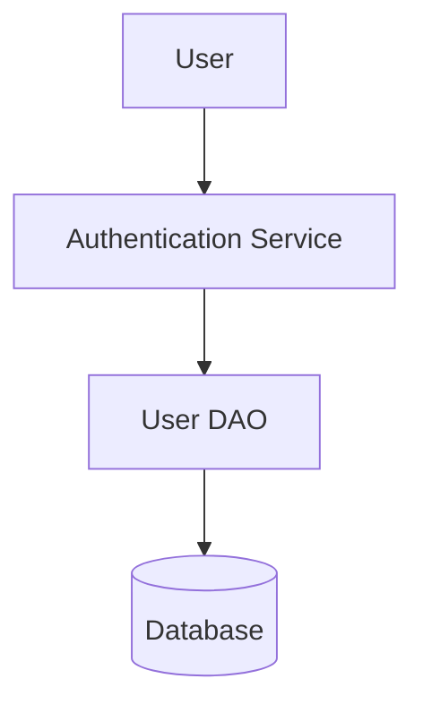

# Export Formats Contract

**Feature**: 009-streamlit-crewai-web-client
**Version**: 1.0.0
**Date**: 2026-01-14

## Overview

This document defines the export formats supported by the web client for agent responses, search results, workspace data, and test artifacts. All exports must include metadata, support configurable options, and validate output before delivery.

---

## 1. Markdown Export

### Purpose

Export agent responses, search results, or workspace data as Markdown files with YAML frontmatter for metadata.

### Format Specification

```markdown
---
title: "Export Title"
generated_by: "Feature 009 - Streamlit Web Client"
generator_version: "1.0.0"
workspace_id: "ws-abc123"
exported_by: "user@example.com"
exported_at: "2026-01-14T10:30:00Z"
artifact_count: 15
agent_role: "senior_developer"
query: "user authentication services"
---

# Export Title

Generated on 2026-01-14 at 10:30:00 UTC

## Summary

[Agent or user-provided summary]

## Contents

### Section 1: Search Results

[Search results table or list]

### Section 2: Agent Analysis

[Agent response text in Markdown]

### Section 3: Artifacts

[Detailed artifact metadata]

## Citations

[1] UserService.java:42-58 - `/path/to/UserService.java`
[2] UserDAO.java:123-145 - `/path/to/UserDAO.java`

## Diagrams



---

*Generated by Feature 009 - Streamlit Web Client v1.0.0*
```

### YAML Frontmatter Schema

```yaml
title: string                  # Export title
generated_by: string           # Tool name
generator_version: string      # Semantic version
workspace_id: string           # Optional: workspace UUID
exported_by: string            # User email or username
exported_at: string            # ISO 8601 timestamp
artifact_count: integer        # Number of artifacts included
agent_role: string             # Optional: agent that generated content
query: string                  # Optional: original user query
tags: array[string]            # Optional: tags for categorization
project: string                # Optional: project name filter
```

### Content Structure

1. **Header Section**: Title, generation timestamp, summary
2. **Main Content**: Organized by sections (configurable)
   - Search results (table or list)
   - Agent responses (formatted Markdown)
   - Artifact details (metadata cards)
3. **Citations**: Numbered references with file paths and line numbers
4. **Diagrams**: Mermaid code blocks for architecture diagrams
5. **Footer**: Generator attribution

### Formatting Rules

- **Headings**: Use ATX-style headers (# ## ###)
- **Code Blocks**: Fenced with triple backticks and language identifier
- **Tables**: GitHub-flavored Markdown table syntax
- **Links**: Use inline links `[text](url)` for artifact references
- **Lists**: Use unordered (-) or ordered (1.) lists
- **Emphasis**: Use `**bold**` for emphasis, `*italic*` for secondary emphasis
- **Line Length**: No hard limit (Markdown is reflowable)

### Export Options

```python
class MarkdownExportOptions:
    include_metadata: bool = True      # Include YAML frontmatter
    include_citations: bool = True     # Include citations section
    include_diagrams: bool = True      # Include Mermaid diagrams
    include_toc: bool = True           # Generate table of contents
    max_artifacts: int = 50            # Limit number of artifacts
    format_code: bool = True           # Format code blocks with syntax
    embed_images: bool = False         # Embed images as base64 (default: link)
```

### Output File

- **Filename Format**: `{title_slug}_{timestamp}.md`
- **Example**: `authentication_analysis_20260114_103000.md`
- **Encoding**: UTF-8
- **Line Endings**: LF (Unix-style)

### Validation

- YAML frontmatter must parse without errors
- All section headers must be unique
- All citation references must have corresponding entries
- Mermaid diagrams must be valid syntax (optional: validate with mmdc)

### Example Export

See [examples/markdown-export-sample.md](./examples/markdown-export-sample.md)

---

## 2. PDF Export

### Purpose

Generate professional PDF reports for stakeholder distribution with cover page, table of contents, and formatted content.

### Format Specification

**Library**: ReportLab (Python PDF generation)

**Document Structure**:

1. **Cover Page**
   - Title (centered, 24pt, bold)
   - Subtitle (generated by agent role)
   - Generated date (ISO 8601 format)
   - Project/workspace name
   - Exported by (user)
   - Logo (optional, top-right corner)

2. **Table of Contents**
   - Auto-generated from section headers
   - Page numbers linked
   - Hierarchical indentation (2 levels)

3. **Content Pages**
   - Header: Document title (left), Page number (right)
   - Footer: Generation timestamp (left), "Confidential" (center), Page X of Y (right)
   - Margins: 1 inch (72pt) all sides
   - Font: Helvetica (sans-serif) or Times Roman (serif)
   - Font size: 11pt body, 14pt headings, 18pt section headers

4. **Embedded Diagrams**
   - Convert Mermaid to PNG via mermaid-cli (`mmdc`)
   - Embed PNG images at 300 DPI
   - Center-align with caption below

5. **Code Blocks**
   - Monospace font (Courier)
   - Light gray background (#F5F5F5)
   - Syntax highlighting (optional, via Pygments)

### Export Options

```python
class PDFExportOptions:
    page_size: str = 'LETTER'          # 'LETTER', 'A4', 'LEGAL'
    orientation: str = 'portrait'      # 'portrait', 'landscape'
    font: str = 'Helvetica'            # 'Helvetica', 'Times-Roman'
    font_size: int = 11                # 10, 11, 12
    include_cover: bool = True         # Generate cover page
    include_toc: bool = True           # Generate table of contents
    include_header_footer: bool = True # Page headers and footers
    embed_diagrams: bool = True        # Convert and embed Mermaid diagrams
    syntax_highlighting: bool = True   # Syntax highlight code blocks
    compress: bool = True              # Compress PDF (smaller file size)
```

### Styling

```python
# ReportLab StyleSheet
styles = getSampleStyleSheet()

cover_title = ParagraphStyle(
    'CoverTitle',
    parent=styles['Title'],
    fontSize=24,
    textColor=colors.HexColor('#1E3A8A'),  # Dark blue
    alignment=TA_CENTER,
    spaceAfter=12
)

section_header = ParagraphStyle(
    'SectionHeader',
    parent=styles['Heading1'],
    fontSize=18,
    textColor=colors.HexColor('#1E3A8A'),
    spaceAfter=12,
    spaceBefore=18
)

body_text = ParagraphStyle(
    'BodyText',
    parent=styles['BodyText'],
    fontSize=11,
    leading=14,  # Line height
    spaceAfter=6
)

code_block = ParagraphStyle(
    'CodeBlock',
    parent=styles['Code'],
    fontName='Courier',
    fontSize=9,
    leftIndent=20,
    rightIndent=20,
    backColor=colors.HexColor('#F5F5F5'),
    borderColor=colors.HexColor('#E5E5E5'),
    borderWidth=1,
    borderPadding=8
)
```

### Output File

- **Filename Format**: `{title_slug}_{timestamp}.pdf`
- **Example**: `authentication_analysis_20260114_103000.pdf`
- **PDF Version**: 1.4 (compatible with all readers)
- **Compression**: Enabled (reduce file size by ~30%)
- **Metadata**: Title, Author, Subject, Keywords, Creator, Creation Date

### Validation

- All pages must render without errors
- TOC links must resolve to correct pages
- Embedded images must not be corrupted
- PDF/A compliance (optional, for archival)

### Example Export

See [examples/pdf-export-sample.pdf](./examples/pdf-export-sample.pdf)

---

## 3. JSON Export

### Purpose

Export structured data for programmatic consumption, API integration, or data analysis.

### Format Specification

**JSON Schema**: [agent-response-schema.json](./agent-response-schema.json)

**Structure**:

```json
{
  "export_metadata": {
    "export_id": "exp-123e4567-e89b-12d3-a456-426614174000",
    "export_type": "workspace",
    "exported_by": "user@example.com",
    "exported_at": "2026-01-14T10:30:00Z",
    "generator_version": "1.0.0",
    "workspace_id": "ws-abc123",
    "workspace_name": "Authentication Module Review"
  },
  "query": {
    "text": "user authentication services",
    "filters": {
      "artifact_types": ["DaoCall", "BackendDoc"],
      "project": "com.example:backend:2.0.0"
    }
  },
  "artifacts": [
    {
      "artifact_id": "artifact-uuid-001",
      "artifact_type": "BackendDoc",
      "file_path": "/path/to/UserService.java",
      "confidence_score": 0.95,
      "metadata": {
        "class_name": "UserService",
        "methods": ["authenticate", "validateCredentials"],
        "dependencies": ["UserDAO", "BCryptPasswordEncoder"]
      }
    }
  ],
  "agent_responses": [
    {
      "agent_role": "senior_developer",
      "response_id": "resp-uuid-001",
      "timestamp": "2026-01-14T10:35:00Z",
      "query": "Explain authentication flow",
      "response_text": "...",
      "citations": [...],
      "tools_used": [...],
      "confidence": "high",
      "metadata": {
        "execution_time_ms": 8234,
        "tokens_used": 1542
      }
    }
  ],
  "annotations": [
    {
      "annotation_id": "ann-uuid-001",
      "artifact_id": "artifact-uuid-001",
      "note": "Security issue: missing input validation",
      "tags": ["security", "bug"],
      "author": "user@example.com",
      "created_at": "2026-01-14T09:00:00Z"
    }
  ],
  "statistics": {
    "total_artifacts": 15,
    "artifact_types": {
      "DaoCall": 8,
      "BackendDoc": 5,
      "GwtPresenter": 2
    },
    "agent_invocations": 3,
    "total_execution_time_ms": 24567,
    "total_tokens_used": 4823
  }
}
```

### Export Options

```python
class JSONExportOptions:
    indent: int = 2                    # Indentation spaces (0 = compact)
    sort_keys: bool = True             # Sort object keys alphabetically
    include_metadata: bool = True      # Include export_metadata section
    include_annotations: bool = True   # Include annotations
    include_statistics: bool = True    # Include statistics summary
    max_artifacts: int = 1000          # Limit number of artifacts
    pretty_print: bool = True          # Human-readable formatting
```

### Output File

- **Filename Format**: `{title_slug}_{timestamp}.json`
- **Example**: `authentication_analysis_20260114_103000.json`
- **Encoding**: UTF-8
- **Content-Type**: `application/json`

### Validation

- JSON must parse without errors (strict mode)
- All UUIDs must be valid RFC 4122 format
- All timestamps must be valid ISO 8601 format
- Schema validation against [agent-response-schema.json](./agent-response-schema.json)

### Example Export

See [examples/json-export-sample.json](./examples/json-export-sample.json)

---

## 4. CSV Export

### Purpose

Export tabular data (artifact lists, search results) for spreadsheet analysis or database import.

### Format Specification

**Standard**: RFC 4180 (CSV specification)

**Structure**:

```csv
artifact_id,artifact_type,file_path,confidence_score,class_name,method_count,line_count,tags
artifact-uuid-001,BackendDoc,/path/to/UserService.java,0.95,UserService,12,345,"authentication,security"
artifact-uuid-002,DaoCall,/path/to/UserDAO.java,0.89,UserDAO,8,234,"database,user"
artifact-uuid-003,GwtPresenter,/path/to/LoginPresenter.java,0.92,LoginPresenter,15,456,"frontend,login"
```

**Column Selection**: User-configurable (select from artifact schema)

**Common Column Sets**:

1. **Minimal**: artifact_id, artifact_type, file_path
2. **Standard**: artifact_id, artifact_type, file_path, confidence_score, class_name
3. **Full**: All available metadata fields
4. **Custom**: User selects specific fields

### Export Options

```python
class CSVExportOptions:
    delimiter: str = ','               # ',' (comma), ';' (semicolon), '\t' (tab)
    quotechar: str = '"'               # Quote character
    escape_char: str = '\\'            # Escape character
    include_header: bool = True        # Include column names in first row
    line_terminator: str = '\r\n'      # '\r\n' (Windows), '\n' (Unix)
    columns: List[str] = None          # Selected columns (None = all)
    max_rows: int = 10000              # Limit number of rows
    encoding: str = 'utf-8'            # 'utf-8', 'utf-8-sig' (BOM), 'latin-1'
```

### Encoding Rules

- **Text Fields**: Quote if contains delimiter, newline, or quote character
- **Numeric Fields**: No quotes (preserve numeric type in Excel)
- **Array Fields**: Serialize as JSON array or comma-separated list
- **Null Values**: Empty string (not "null" or "None")
- **Boolean Fields**: "true"/"false" (lowercase)

### Output File

- **Filename Format**: `{title_slug}_{timestamp}.csv`
- **Example**: `authentication_artifacts_20260114_103000.csv`
- **Encoding**: UTF-8 with BOM (for Excel compatibility) or UTF-8 (for data tools)
- **Content-Type**: `text/csv`

### Validation

- All rows must have same number of columns
- No unescaped delimiters or quotes
- Header row must not be empty
- File must parse without errors in Excel and pandas

### Example Export

See [examples/csv-export-sample.csv](./examples/csv-export-sample.csv)

---

## 5. Gherkin Export (.feature)

### Purpose

Export BDD test cases generated by Gherkin Test Writer Agent in Cucumber-compatible format.

### Format Specification

**Standard**: Gherkin v6 (Cucumber)

**Structure**:

```gherkin
# language: en
@authentication @smoke
Feature: User Authentication
  As a registered user
  I want to log in to the system
  So that I can access my account

  Background:
    Given the system is running
    And the database is seeded with test users

  @positive @critical
  Scenario: Successful login with valid credentials
    Given I am on the login page
    When I enter username "testuser" and password "SecurePass123"
    And I click the "Login" button
    Then I should be redirected to the dashboard
    And I should see a welcome message "Welcome, testuser"
    And a JWT token should be stored in session storage

  @negative
  Scenario: Failed login with invalid password
    Given I am on the login page
    When I enter username "testuser" and password "WrongPassword"
    And I click the "Login" button
    Then I should see an error message "Invalid username or password"
    And I should remain on the login page
    And no JWT token should be stored

  @negative @edge-case
  Scenario Outline: Input validation for login form
    Given I am on the login page
    When I enter username "<username>" and password "<password>"
    And I click the "Login" button
    Then I should see a validation error "<error_message>"

    Examples:
      | username | password     | error_message                        |
      |          | password123  | Username is required                 |
      | user     |              | Password is required                 |
      | ab       | password123  | Username must be at least 3 chars    |
      | user     | 123          | Password must be at least 8 chars    |

# Generated by Feature 009 - Streamlit Web Client v1.0.0
# Agent: Gherkin Test Writer
# Exported: 2026-01-14T11:45:00Z
```

### Export Options

```python
class GherkinExportOptions:
    language: str = 'en'               # Gherkin language
    include_tags: bool = True          # Include @tags for scenarios
    include_background: bool = True    # Include Background section
    include_metadata: bool = True      # Include generation comments
    scenario_format: str = 'scenario'  # 'scenario' or 'scenario_outline'
    max_examples: int = 10             # Limit rows in Examples table
```

### Syntax Rules

- **Feature**: One per file, required
- **Background**: Optional, shared setup for all scenarios
- **Scenario**: Test case with Given-When-Then steps
- **Scenario Outline**: Parameterized test with Examples table
- **Tags**: Start with @, space-separated (e.g., `@smoke @critical`)
- **Comments**: Start with #, ignored by parser
- **Steps**: Given, When, Then, And, But (case-sensitive)

### Output File

- **Filename Format**: `{feature_slug}.feature`
- **Example**: `user_authentication.feature`
- **Encoding**: UTF-8
- **Line Endings**: LF (Unix-style)
- **Content-Type**: `text/plain`

### Validation

- Parse with Gherkin parser (cucumber-gherkin library)
- All scenarios must have at least one Given, When, Then step
- Scenario Outlines must have Examples table
- Tags must start with @
- No duplicate scenario names within feature

### Example Export

See [examples/gherkin-export-sample.feature](./examples/gherkin-export-sample.feature)

---

## 6. Playwright Export (.spec.ts / .spec.js)

### Purpose

Export E2E browser test scripts generated by Playwright Test Writer Agent.

### Format Specification

**Standard**: Playwright Test (TypeScript or JavaScript)

**Structure** (TypeScript):

```typescript
import { test, expect, Page } from '@playwright/test';

/**
 * User Authentication E2E Tests
 * Generated by Feature 009 - Streamlit Web Client v1.0.0
 * Agent: Playwright Test Writer
 * Exported: 2026-01-14T12:00:00Z
 */

test.describe('User Authentication', () => {
  let page: Page;

  test.beforeEach(async ({ browser }) => {
    page = await browser.newPage();
    await page.goto('http://localhost:8080/login');
  });

  test.afterEach(async () => {
    await page.close();
  });

  test('should login successfully with valid credentials', async () => {
    // Arrange
    const username = 'testuser';
    const password = 'SecurePass123';

    // Act
    await page.fill('[data-testid="username-input"]', username);
    await page.fill('[data-testid="password-input"]', password);
    await page.click('[data-testid="login-button"]');

    // Assert
    await expect(page).toHaveURL('http://localhost:8080/dashboard');
    await expect(page.locator('[data-testid="welcome-message"]'))
      .toContainText('Welcome, testuser');

    // Verify JWT token in session storage
    const token = await page.evaluate(() => sessionStorage.getItem('jwt_token'));
    expect(token).not.toBeNull();
  });

  test('should show error message with invalid password', async () => {
    // Arrange
    const username = 'testuser';
    const password = 'WrongPassword';

    // Act
    await page.fill('[data-testid="username-input"]', username);
    await page.fill('[data-testid="password-input"]', password);
    await page.click('[data-testid="login-button"]');

    // Assert
    await expect(page.locator('[data-testid="error-message"]'))
      .toContainText('Invalid username or password');
    await expect(page).toHaveURL('http://localhost:8080/login');
  });

  test.describe('Input Validation', () => {
    const testCases = [
      { username: '', password: 'password123', error: 'Username is required' },
      { username: 'user', password: '', error: 'Password is required' },
      { username: 'ab', password: 'password123', error: 'Username must be at least 3 chars' },
    ];

    testCases.forEach(({ username, password, error }) => {
      test(`should validate: ${error}`, async () => {
        await page.fill('[data-testid="username-input"]', username);
        await page.fill('[data-testid="password-input"]', password);
        await page.click('[data-testid="login-button"]');

        await expect(page.locator('[data-testid="validation-error"]'))
          .toContainText(error);
      });
    });
  });
});
```

### Export Options

```python
class PlaywrightExportOptions:
    language: str = 'typescript'       # 'typescript' or 'javascript'
    test_style: str = 'arrange-act-assert'  # 'arrange-act-assert' or 'given-when-then'
    include_page_objects: bool = True  # Generate page object classes
    include_fixtures: bool = True      # Generate test fixtures
    include_metadata: bool = True      # Include generation comments
    locator_strategy: str = 'data-testid'  # 'data-testid', 'css', 'xpath'
    assertion_style: str = 'expect'    # 'expect' or 'assert'
```

### Code Structure

1. **Imports**: Playwright test utilities
2. **Header Comment**: Generation metadata
3. **Test Suite**: `test.describe()` block
4. **Setup/Teardown**: `beforeEach`, `afterEach` hooks
5. **Test Cases**: `test()` blocks with descriptive names
6. **Page Objects**: Separate classes for UI components (optional)
7. **Assertions**: Playwright `expect()` assertions

### Locator Strategies

1. **data-testid** (Preferred): `page.locator('[data-testid="login-button"]')`
2. **CSS Selectors**: `page.locator('#login-form button.submit')`
3. **XPath**: `page.locator('//button[text()="Login"]')`
4. **Text Content**: `page.locator('button:has-text("Login")')`

### Output File

- **Filename Format**: `{feature_slug}.spec.{ts|js}`
- **Example**: `user_authentication.spec.ts`
- **Encoding**: UTF-8
- **Line Endings**: LF (Unix-style)
- **Content-Type**: `text/plain`

### Validation

- TypeScript: Compile with `tsc --noEmit` (no syntax errors)
- JavaScript: Lint with ESLint (no errors)
- Playwright: Dry-run with `npx playwright test --dry-run`
- All test names must be unique
- All locators must be valid selectors

### Example Export

See [examples/playwright-export-sample.spec.ts](./examples/playwright-export-sample.spec.ts)

---

## Export Service API

All export operations are handled by `ExportService`:

```python
from codeindex.web.services.export_service import ExportService
from pathlib import Path

# Initialize service
export_service = ExportService(
    export_dir=Path('data/exports'),
    cleanup_interval_hours=24
)

# Export to Markdown
markdown_file = export_service.export_markdown(
    content=agent_response,
    options=MarkdownExportOptions(
        include_metadata=True,
        include_citations=True,
        include_diagrams=True
    ),
    filename="authentication_analysis"
)

# Export to PDF
pdf_file = export_service.export_pdf(
    content=agent_response,
    options=PDFExportOptions(
        page_size='LETTER',
        include_cover=True,
        include_toc=True
    ),
    filename="authentication_analysis"
)

# Export to JSON
json_file = export_service.export_json(
    data=workspace_data,
    options=JSONExportOptions(
        indent=2,
        sort_keys=True
    ),
    filename="workspace_export"
)

# Export to CSV
csv_file = export_service.export_csv(
    artifacts=search_results,
    options=CSVExportOptions(
        columns=['artifact_id', 'artifact_type', 'file_path', 'confidence_score'],
        include_header=True
    ),
    filename="search_results"
)

# Export Gherkin test
gherkin_file = export_service.export_gherkin(
    content=gherkin_test_content,
    options=GherkinExportOptions(
        include_tags=True,
        include_background=True
    ),
    filename="user_authentication"
)

# Export Playwright test
playwright_file = export_service.export_playwright(
    content=playwright_test_content,
    options=PlaywrightExportOptions(
        language='typescript',
        include_page_objects=True
    ),
    filename="user_authentication"
)
```

---

## Export Cleanup

All exports are automatically cleaned up after 24 hours:

```python
# Cleanup job (run via cron or scheduler)
export_service.cleanup_expired_exports()

# Manual cleanup
export_service.delete_export(export_id='exp-abc123')
```

---

## Testing Requirements

Each export format must have:

1. **Unit Tests**: Validate formatting, metadata, and validation
2. **Integration Tests**: Generate exports from real data
3. **Validation Tests**: Parse/compile exported files to verify correctness
4. **Performance Tests**: Measure generation time for large exports (50+ pages)

Example test:

```python
def test_markdown_export_with_citations():
    """Test Markdown export includes citations."""
    response = AgentResponse(
        agent_role='senior_developer',
        response_text='Analysis...',
        citations=[Citation(...)]
    )

    export_service = ExportService(export_dir=tmp_path)
    markdown_file = export_service.export_markdown(
        content=response,
        filename='test_export'
    )

    content = markdown_file.read_text()
    assert '## Citations' in content
    assert '[1]' in content
    assert response.citations[0].file_path in content
```

---

**Version**: 1.0.0
**Last Updated**: 2026-01-14
**Status**: Final - Ready for Implementation
