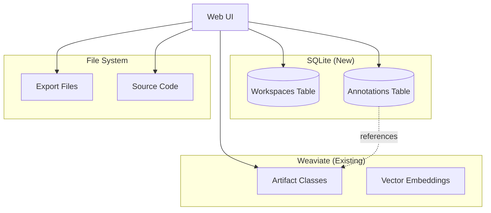
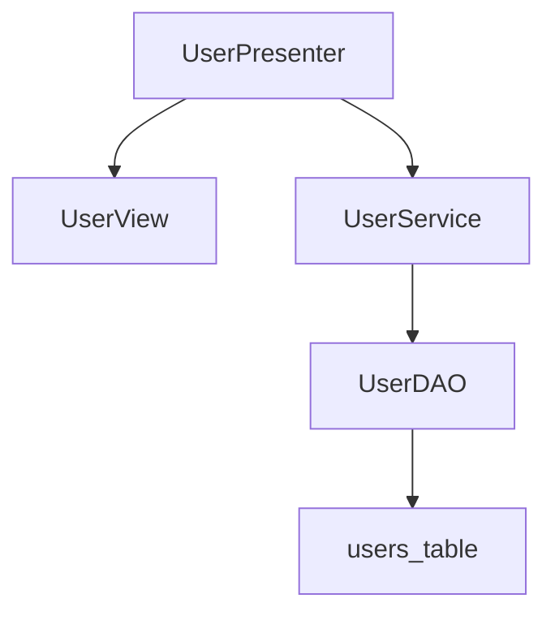
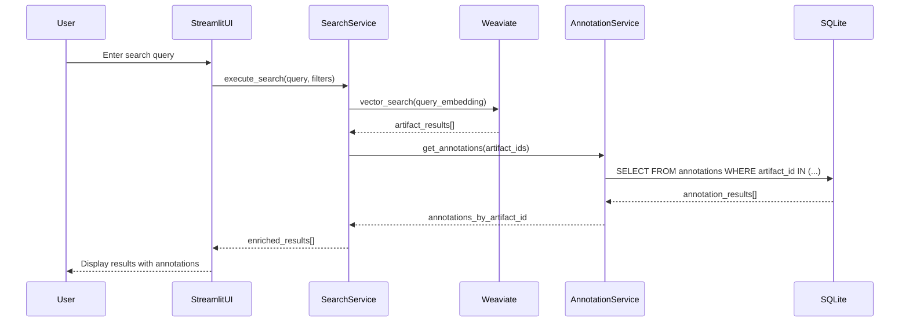
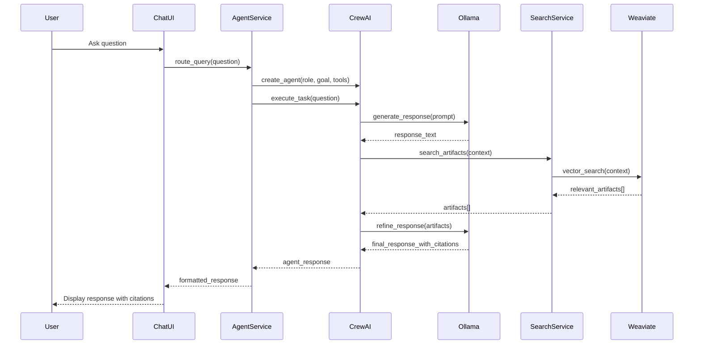
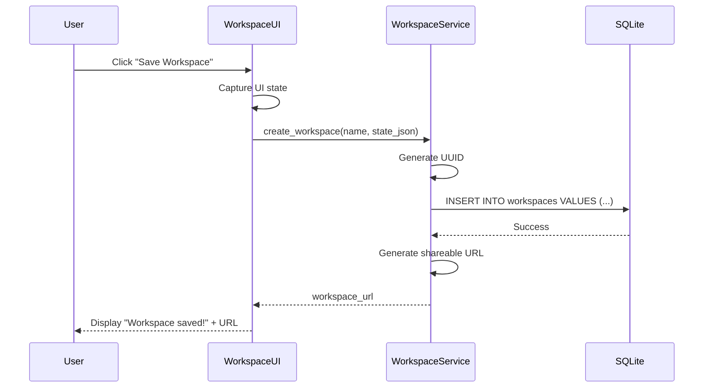

# Feature 009: Data Model

## Overview

Feature 009 introduces new data structures for workspace management, annotations, and agent configurations. This document defines schemas, relationships, and access patterns.

## Data Storage Architecture



## SQLite Database Schema

### Workspaces Table

Stores saved UI states for collaborative analysis.

```sql
CREATE TABLE workspaces (
    -- Primary Key
    id TEXT PRIMARY KEY,                -- UUID (e.g., 'workspace-abc123')

    -- Metadata
    name TEXT NOT NULL,                 -- User-defined name (e.g., 'Authentication Module Analysis')
    creator TEXT,                       -- Username or email
    description TEXT,                   -- Optional description

    -- State Snapshot
    state_json TEXT NOT NULL,           -- JSON blob (see structure below)

    -- Tags and Categories
    tags TEXT,                          -- Comma-separated tags (e.g., 'auth,security,review')
    category TEXT,                      -- Optional category (e.g., 'PRD Generation', 'Code Review')

    -- Timestamps
    created_at TIMESTAMP DEFAULT CURRENT_TIMESTAMP,
    updated_at TIMESTAMP DEFAULT CURRENT_TIMESTAMP,
    last_accessed_at TIMESTAMP,         -- Track usage frequency

    -- Statistics
    artifact_count INTEGER DEFAULT 0,   -- Number of artifacts in workspace
    view_count INTEGER DEFAULT 0        -- Number of times workspace loaded
);

-- Indexes for performance
CREATE INDEX idx_workspaces_creator ON workspaces(creator);
CREATE INDEX idx_workspaces_tags ON workspaces(tags);
CREATE INDEX idx_workspaces_updated_at ON workspaces(updated_at DESC);
```

**state_json Structure**:
```json
{
  "search": {
    "query": "user authentication",
    "filters": {
      "artifact_types": ["DaoCall", "GwtPresenter"],
      "project": "com.example:app:1.0.0"
    },
    "sort_by": "confidence",
    "results_per_page": 50
  },
  "selected_artifacts": [
    "uuid-1234",
    "uuid-5678"
  ],
  "agent_settings": {
    "verbosity": "standard",
    "technical_level": "senior",
    "citation_style": "inline"
  },
  "ui_state": {
    "active_page": "Search",
    "sidebar_expanded": true,
    "theme": "light"
  },
  "notes": {
    "general": "Analyzing auth flow for security audit"
  }
}
```

**Access Patterns**:
- **Create**: User clicks "Save Workspace" → generate UUID → insert row
- **Read**: Load workspace by ID → parse `state_json` → restore UI state
- **Update**: User modifies workspace → update `state_json` → increment `view_count`
- **Delete**: User deletes workspace → soft delete or hard delete (configurable)
- **List**: Display workspace list (ordered by `updated_at DESC`)

### Annotations Table

Stores user-generated notes and tags for artifacts.

```sql
CREATE TABLE annotations (
    -- Primary Key
    id TEXT PRIMARY KEY,                -- UUID (e.g., 'annotation-xyz789')

    -- Artifact Reference
    artifact_id TEXT NOT NULL,          -- Weaviate artifact UUID
    artifact_type TEXT,                 -- Optional: DaoCall, GwtPresenter, etc.

    -- Content
    note TEXT,                          -- User note (plain text or Markdown)
    tags TEXT,                          -- Comma-separated tags (e.g., 'bug,security,refactor')

    -- Metadata
    author TEXT,                        -- Username or email
    visibility TEXT DEFAULT 'shared',   -- 'shared' or 'private' (future enhancement)

    -- Timestamps
    created_at TIMESTAMP DEFAULT CURRENT_TIMESTAMP,
    updated_at TIMESTAMP DEFAULT CURRENT_TIMESTAMP,

    -- Version Tracking (future enhancement)
    version INTEGER DEFAULT 1,
    edited_by TEXT                      -- Last editor (if different from author)
);

-- Indexes for performance
CREATE INDEX idx_annotations_artifact_id ON annotations(artifact_id);
CREATE INDEX idx_annotations_author ON annotations(author);
CREATE INDEX idx_annotations_tags ON annotations(tags);
CREATE INDEX idx_annotations_updated_at ON annotations(updated_at DESC);

-- Full-text search index for notes (SQLite FTS5)
CREATE VIRTUAL TABLE annotations_fts USING fts5(
    artifact_id,
    note,
    tags,
    content='annotations',
    content_rowid='rowid'
);

-- Triggers to keep FTS index in sync
CREATE TRIGGER annotations_ai AFTER INSERT ON annotations BEGIN
    INSERT INTO annotations_fts(rowid, artifact_id, note, tags)
    VALUES (new.rowid, new.artifact_id, new.note, new.tags);
END;

CREATE TRIGGER annotations_au AFTER UPDATE ON annotations BEGIN
    UPDATE annotations_fts SET artifact_id = new.artifact_id, note = new.note, tags = new.tags
    WHERE rowid = old.rowid;
END;

CREATE TRIGGER annotations_ad AFTER DELETE ON annotations BEGIN
    DELETE FROM annotations_fts WHERE rowid = old.rowid;
END;
```

**Access Patterns**:
- **Create**: User adds note/tags → generate UUID → insert row
- **Read**: Load artifact detail page → query annotations by `artifact_id`
- **Update**: User edits note → update row → increment `version`
- **Delete**: User deletes annotation → hard delete
- **Search**: Full-text search on notes → query `annotations_fts` table
- **Tag Autocomplete**: Query distinct tags → `SELECT DISTINCT tags FROM annotations`

## Agent Configuration Schema

Agent definitions stored as Python dataclasses (not persisted in database).

```python
from dataclasses import dataclass, field
from typing import List, Optional
from enum import Enum

class AgentRole(Enum):
    SENIOR_DEVELOPER = "Senior Developer"
    DATA_ANALYST = "Data Analyst"
    FRONTEND_SPECIALIST = "Frontend Specialist"
    BACKEND_SPECIALIST = "Backend Specialist"
    PRD_WRITER = "PRD Writer"
    SPECKIT_WRITER = "Spec-Kit Feature Writer"

@dataclass
class AgentConfig:
    """Configuration for a CrewAI agent."""

    # Identity
    role: AgentRole
    goal: str
    backstory: str

    # Behavior
    verbose: bool = True
    max_iterations: int = 10
    allow_delegation: bool = False

    # LLM Settings
    llm_model: str = "gemma3:12b"
    temperature: float = 0.7
    max_tokens: int = 2000

    # Tools (assigned at runtime)
    tools: List[str] = field(default_factory=list)  # Tool names

    # Output Formatting
    output_format: str = "markdown"  # 'markdown', 'json', 'text'
    citation_style: str = "inline"   # 'inline', 'footnotes', 'none'
    technical_level: str = "senior"  # 'junior', 'mid', 'senior'

@dataclass
class AgentResponse:
    """Response from an agent query."""

    # Metadata
    agent_role: AgentRole
    query: str
    timestamp: str
    duration_seconds: float

    # Content
    response_text: str
    citations: List[dict]  # [{"artifact_id": "uuid", "file_path": "...", "line": 42}]

    # Quality Indicators
    confidence: float  # 0.0 to 1.0
    tokens_used: int

    # Follow-Ups
    suggested_questions: List[str]

    # Error Handling
    error: Optional[str] = None
    retry_count: int = 0
```

## Weaviate Schema (Existing - No Changes)

Feature 009 reuses existing Weaviate artifact classes:

| Class | Description | Key Properties |
|-------|-------------|----------------|
| `DaoCall` | Data Access Object | `class_name`, `method_names`, `database_operations` |
| `GwtPresenter` | GWT Presenter | `class_name`, `event_handlers`, `rpc_calls`, `navigation_targets` |
| `GwtView` | GWT View | `class_name`, `ui_fields`, `template_file` |
| `GwtUiBinder` | GWT UiBinder Template | `template_file`, `form_fields`, `widget_hierarchy` |
| `DtoArtifact` | Data Transfer Object | `class_name`, `fields`, `validation_rules` |
| `IbatisStatement` | iBATIS SQL Statement | `statement_id`, `sql_text`, `parameter_type` |
| `DbTable` | Database Table | `table_name`, `columns`, `foreign_keys` |
| `GwtEndpoint` | GWT RPC Endpoint | `service_name`, `method_signatures` |
| `JspForm` | JSP Form | `form_id`, `form_fields`, `submit_action` |
| `BackendDoc` | Backend Documentation | `description`, `endpoints`, `dependencies` |
| `JsArtifact` | JavaScript Artifact | `file_path`, `functions`, `dependencies` |

**Note**: Annotations are NOT stored in Weaviate (to avoid schema changes). Instead, UI joins SQLite annotations with Weaviate artifacts at query time.

## Export File Schema

Temporary export files stored in `data/exports/` directory.

### Markdown Export

```markdown
---
title: "Authentication Module Analysis"
workspace: "workspace-abc123"
generated_at: "2026-01-14T10:30:00Z"
generated_by: "GEMINI Code Analysis Pipeline v1.0"
artifacts_count: 15
---

# Authentication Module Analysis

## Executive Summary

...agent-generated content...

## Artifacts

### DAO: UserDAO
- **File**: `src/main/java/com/example/dao/UserDAO.java`
- **Operations**: findByUsername, create, update
- **Confidence**: 95%

...

## Relationship Diagram



## Notes and Annotations

### UserDAO (artifact-uuid-1234)
**Author**: john@example.com
**Tags**: security, refactor
**Note**: Need to add password hashing before storing in DB.

...
```

### JSON Export

```json
{
  "metadata": {
    "title": "Authentication Module Analysis",
    "workspace_id": "workspace-abc123",
    "generated_at": "2026-01-14T10:30:00Z",
    "generator": "GEMINI Code Analysis Pipeline v1.0",
    "artifacts_count": 15
  },
  "artifacts": [
    {
      "id": "artifact-uuid-1234",
      "type": "DaoCall",
      "class_name": "UserDAO",
      "file_path": "src/main/java/com/example/dao/UserDAO.java",
      "confidence": 0.95,
      "metadata": {
        "method_names": ["findByUsername", "create", "update"],
        "database_operations": ["SELECT", "INSERT", "UPDATE"]
      },
      "annotations": [
        {
          "author": "john@example.com",
          "tags": ["security", "refactor"],
          "note": "Need to add password hashing before storing in DB.",
          "created_at": "2026-01-14T09:00:00Z"
        }
      ]
    }
  ],
  "relationships": [
    {
      "source_id": "artifact-uuid-1234",
      "target_id": "artifact-uuid-5678",
      "relationship_type": "calls"
    }
  ],
  "agent_summaries": [
    {
      "agent": "Senior Developer",
      "timestamp": "2026-01-14T10:25:00Z",
      "summary": "...agent-generated content...",
      "confidence": 0.85
    }
  ]
}
```

### PDF Export

Generated using ReportLab with structure:
1. **Cover Page**: Title, workspace name, generation date, logo
2. **Table of Contents**: Sections with page numbers
3. **Executive Summary**: Agent-generated overview
4. **Artifact Details**: One page per artifact (metadata, code snippet, annotations)
5. **Relationship Diagrams**: Embedded Mermaid diagrams (rendered as images)
6. **Appendices**: Raw data tables, glossary, references

## Data Flow Diagrams

### Search Flow


### Agent Query Flow


### Workspace Save Flow


## Data Retention and Cleanup

### Workspaces
- **Retention**: Indefinite (until user deletes)
- **Cleanup**: Optional periodic cleanup (delete workspaces not accessed in 90 days)
- **Backup**: Recommended: export workspace list to JSON weekly

### Annotations
- **Retention**: Indefinite (until user deletes)
- **Cleanup**: Orphaned annotations (artifact no longer in Weaviate) marked for review
- **Backup**: Recommended: export annotations to JSON daily

### Export Files
- **Retention**: 24 hours (auto-delete)
- **Cleanup**: Cron job runs daily at midnight to delete exports older than 24h
- **Backup**: Not needed (regenerate on demand)

## Security Considerations

1. **SQL Injection Prevention**: Use parameterized queries for all SQLite operations
2. **File Path Validation**: Sanitize file paths in code viewer to prevent directory traversal
3. **Input Validation**: Validate all user inputs (search queries, notes, tags) for length and content
4. **Rate Limiting**: Track query count per user in SQLite (or Redis for high-scale deployments)
5. **Authentication**: Optional basic auth or OAuth2 for production deployments
6. **Data Isolation**: Future enhancement: add `user_id` column to workspaces/annotations for privacy

## Performance Optimization

1. **SQLite WAL Mode**: Enable Write-Ahead Logging for concurrent reads/writes
2. **Connection Pooling**: Reuse SQLite connections across requests
3. **Indexing**: Indexes on frequently queried columns (artifact_id, author, tags, updated_at)
4. **Full-Text Search**: FTS5 index for fast note search
5. **Caching**: Cache frequently accessed workspaces in Streamlit session state
6. **Batch Operations**: Batch insert annotations when importing from external sources

---

**Version**: 1.0.0 | **Created**: 2026-01-14 | **Status**: Draft
