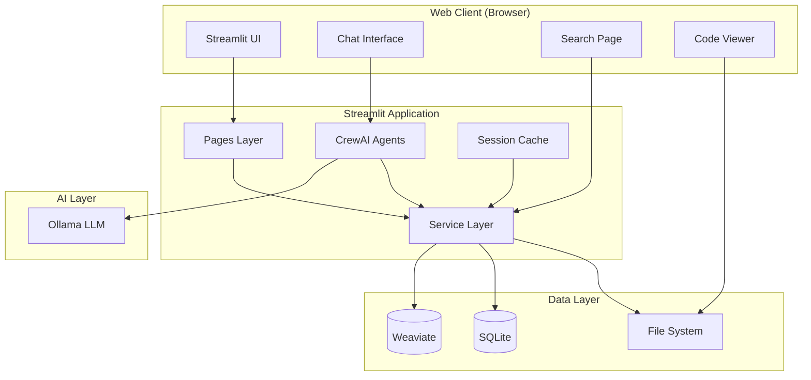

# Feature 009: Streamlit-Based Interactive Analysis Web Client with CrewAI Multi-Agent System

**Feature ID**: 009-streamlit-crewai-web-client
**Type**: New Feature
**Priority**: High
**Estimated Complexity**: Large (8-12 weeks)
**Status**: Draft
**Created**: 2026-01-14
**Constitution Version**: 1.0.0

## Executive Summary

Extend the GEMINI Code Analysis Pipeline from a CLI-only tool into an interactive web application with intelligent multi-agent capabilities. This feature adds a Streamlit-based web interface that enables real-time code exploration, semantic search, and AI-powered analysis through specialized agent roles (Senior Developer, Data Analyst, Frontend/Backend Specialists, PRD Writer, Spec-Kit Feature Writer) orchestrated by the CrewAI framework.

**Target Users**: Development teams, technical leads, product managers, architects analyzing Java/JSP/GWT codebases

**Core Value**: Democratize codebase analysis by providing an intuitive web interface with intelligent agent assistance, enabling non-CLI users to leverage advanced semantic search and automated documentation generation.

## Problem Statement

### Current State

The GEMINI Code Analysis Pipeline is a powerful CLI tool that:
- Discovers and indexes 100k+ file codebases
- Provides semantic search over Weaviate vector database
- Generates comprehensive PRD and architecture documentation
- Supports GWT/JSP/Java/iBATIS artifact analysis

**Limitations**:
1. **CLI-Only Interface**: Requires command-line expertise, limiting accessibility for product managers, junior developers, and non-technical stakeholders
2. **No Interactive Exploration**: Users cannot iteratively refine searches, visualize relationships, or explore artifacts dynamically
3. **Manual Analysis Workflows**: Developers must manually interpret search results and synthesize insights
4. **Static Documentation**: PRD generation is batch-oriented; no real-time collaborative analysis
5. **Steep Learning Curve**: New users struggle with complex CLI parameters and pipeline orchestration

### Desired State

An interactive web application that:
- **Intuitive UI**: Streamlit-based interface accessible via browser with zero installation
- **Real-Time Search**: Live semantic search over Weaviate with instant result previews
- **AI Agent Assistance**: Specialized agents analyze code, answer questions, and generate documentation automatically
- **Collaborative Workflows**: Multiple stakeholders can explore codebases, share insights, and export findings
- **Visual Exploration**: Interactive diagrams, dependency graphs, and artifact relationship visualizations
- **Autonomous Analysis**: Agents work together (CrewAI orchestration) to generate comprehensive reports without manual intervention

## Objectives and Goals

### Primary Objectives

1. **Democratize Access** (Q1 2026)
   - Enable non-CLI users to search and explore codebases via web browser
   - Reduce onboarding time from 2 hours (CLI) to 10 minutes (web UI)
   - Support 10+ concurrent users searching shared Weaviate instance

2. **Intelligent Agent Assistance** (Q1-Q2 2026)
   - Implement 6 specialized CrewAI agents with distinct roles and expertise
   - Enable autonomous multi-agent workflows (e.g., "Analyze authentication module and generate PRD")
   - Achieve 80%+ user satisfaction with agent-generated documentation quality

3. **Real-Time Interactive Analysis** (Q2 2026)
   - Provide sub-2-second semantic search response times
   - Support iterative refinement of queries with AI-suggested follow-ups
   - Enable visual exploration of artifact relationships (click-to-navigate graphs)

4. **Production-Ready Web Service** (Q2 2026)
   - Deploy Streamlit app with authentication and multi-project isolation
   - Support 50+ concurrent users with <3s page load times
   - Maintain 99.5% uptime with health monitoring and auto-recovery

### Success Criteria

- **Adoption**: 80% of team uses web UI instead of CLI within 1 month of launch
- **Performance**: Search queries return in <2 seconds for 95% of requests
- **Agent Quality**: Agent-generated PRDs require <20% manual revision
- **User Satisfaction**: NPS score ≥8/10 for UI usability
- **Scalability**: Support 100k+ artifact corpus with <4GB memory footprint

## User Stories and Use Cases

### Epic 1: Interactive Semantic Search

**US1.1: As a product manager, I want to search for "authentication flow" in natural language and see all related artifacts, so I can understand how users log in without reading code.**

**Acceptance Criteria**:
- Search bar accepts natural language queries (no special syntax required)
- Results include Presenters, Views, DAOs, Services, and database tables
- Each result shows: artifact type, confidence score, file path, and preview snippet
- Click on result opens detailed view with full metadata and relationships
- Search completes in <2 seconds for 95% of queries

**US1.2: As a developer, I want to filter search results by artifact type (DAO, Presenter, DTO) and project, so I can focus on relevant components.**

**Acceptance Criteria**:
- Multi-select filters for artifact types (11 types: DAO, Service, Presenter, View, UiBinder, DTO, etc.)
- Single-select project filter (dropdown populated from Weaviate projects)
- Filters apply instantly without page reload
- Clear filters button resets to default view
- Filter state persists in URL for sharing

**US1.3: As a technical lead, I want to see visual relationship graphs for artifacts, so I can understand dependencies and data flows.**

**Acceptance Criteria**:
- Click "Show Relationships" button on artifact detail page
- Graph displays: current artifact (center), connected artifacts (nodes), relationship types (edge labels)
- Interactive graph: click node to navigate, zoom/pan controls
- Export graph as PNG or Mermaid markdown
- Graph loads in <3 seconds for artifacts with <50 relationships

### Epic 2: AI Agent-Powered Analysis

**US2.1: As a product manager, I want to ask an AI agent "What does the user registration module do?" and receive a comprehensive explanation, so I can write requirements without technical expertise.**

**Acceptance Criteria**:
- Chat interface accepts natural language questions
- Senior Developer Agent responds with: module purpose, key components, data flows, dependencies
- Response includes citations (artifact IDs, file paths) for verification
- Response generated in <30 seconds
- Follow-up questions maintain conversation context

**US2.2: As a data analyst, I want an agent to identify all database tables and foreign key relationships, so I can create an entity-relationship diagram.**

**Acceptance Criteria**:
- "Analyze Database Schema" button triggers Data Analyst Agent
- Agent generates: table list, column definitions, FK relationships, indexes
- Output includes Mermaid ERD diagram (auto-rendered in UI)
- Report identifies missing FKs and data quality issues
- Analysis completes in <2 minutes for 100 tables

**US2.3: As a technical lead, I want agents to collaborate on generating a PRD from scratch, so I can document existing systems without manual effort.**

**Acceptance Criteria**:
- "Generate PRD" workflow button starts multi-agent collaboration
- Agent sequence: Backend Specialist → Frontend Specialist → PRD Writer → Spec-Kit Feature Writer
- Each agent contributes specialized sections (architecture, UI flows, requirements, test plans)
- Final PRD includes: objectives, user stories, functional/non-functional requirements, diagrams
- Generation completes in <5 minutes for medium-sized modules (20-30 artifacts)
- Output format: Markdown file downloadable + preview in UI

**US2.4: As a developer, I want to configure agent behavior (verbosity, expertise level, output format), so agents match my team's documentation standards.**

**Acceptance Criteria**:
- Agent settings panel accessible from sidebar
- Configurable parameters: output detail (concise/standard/verbose), technical level (junior/senior), citation style (inline/footnotes)
- Settings persist per user session
- Preview example outputs for each setting combination
- Apply settings button updates agent behavior immediately

**US2.5: As a QA engineer, I want an agent to generate Gherkin feature files from user stories, so I can create BDD test cases without manual translation.**

**Acceptance Criteria**:
- "Generate Gherkin Tests" button triggers Gherkin Test Writer Agent
- Agent analyzes user stories from PRD or selected artifacts
- Agent generates feature files with: Feature description, Background steps, Scenario outlines, Given-When-Then steps, Examples tables
- Output follows Gherkin syntax standards (Cucumber-compatible)
- Test cases cover happy paths, edge cases, and error scenarios
- Generation completes in <2 minutes for 10 user stories
- Output format: .feature files downloadable + preview in UI

**US2.6: As a QA engineer, I want an agent to generate Playwright E2E test scripts for web UI, so I can automate browser testing without writing code manually.**

**Acceptance Criteria**:
- "Generate Playwright Tests" button triggers Playwright Test Writer Agent
- Agent analyzes UI components, forms, and navigation flows from artifacts
- Agent generates Playwright test files with: Page object models, Test cases with descriptions, Locators (CSS/XPath), Assertions, Test data setup/teardown
- Output follows Playwright best practices (async/await, page fixtures, test isolation)
- Test scripts include: navigation tests, form submission tests, validation tests, error handling tests
- Generation completes in <3 minutes for 20 UI components
- Output format: .spec.ts/.spec.js files downloadable + preview in UI

### Epic 3: Collaborative Workspaces

**US3.1: As a team lead, I want to create saved workspaces with specific search queries and agent configurations, so my team can share analysis contexts.**

**Acceptance Criteria**:
- "Create Workspace" button saves: current search query, filters, selected artifacts, agent settings
- Workspace assigned unique URL (shareable link)
- Workspace list shows: name, creator, last modified, artifact count
- Load workspace restores exact UI state (query, filters, selections)
- Workspaces stored in SQLite database (not Weaviate)

**US3.2: As a product manager, I want to export analysis reports to PDF/Markdown, so I can share findings with stakeholders outside the tool.**

**Acceptance Criteria**:
- Export button on agent reports and search results pages
- PDF export includes: cover page, table of contents, agent summaries, artifact details, diagrams
- Markdown export includes: frontmatter metadata, formatted tables, embedded Mermaid diagrams
- Exports preserve formatting and citations
- Export generation completes in <10 seconds for 50-page reports

**US3.3: As a developer, I want to annotate artifacts with notes and tags, so I can track findings during code reviews.**

**Acceptance Criteria**:
- "Add Note" button on artifact detail page opens text editor
- Notes support: plain text, Markdown, code snippets
- Tags are free-form text (autocomplete from existing tags)
- Notes/tags visible to all users (shared annotations)
- Annotations stored in SQLite database (linked to artifact IDs)
- Search includes notes/tags in results

### Epic 4: Real-Time File System Integration

**US4.1: As a developer, I want to view source code directly in the UI with syntax highlighting, so I can verify agent findings without opening an IDE.**

**Acceptance Criteria**:
- Click artifact opens code viewer in split pane (list | code)
- Syntax highlighting for Java, JSP, JavaScript, XML, SQL
- Line numbers, search within file, copy code button
- Highlight referenced lines (e.g., method definitions found by agent)
- Code viewer loads in <1 second for files <5000 lines

**US4.2: As a technical lead, I want to see file system structure as a tree view, so I can navigate projects like in an IDE.**

**Acceptance Criteria**:
- Sidebar shows expandable directory tree (root = JAVA_SOURCE_DIR)
- File icons indicate type (Java, JSP, XML, config)
- Click file opens code viewer; click directory expands children
- Tree supports: search by filename, collapse all, expand to selected file
- Tree loads in <2 seconds for 10k files

**US4.3: As a developer, I want to jump from artifact to source file and vice versa, so I can correlate analysis with code.**

**Acceptance Criteria**:
- Artifact detail page has "View Source" button (opens file in code viewer)
- Code viewer has "Show Artifacts" button (lists artifacts extracted from file)
- Bidirectional navigation maintains context (return to previous view)
- Navigation updates URL for browser back/forward support

## Functional Requirements

### FR1: Web Application Core

**FR1.1**: Web application MUST be built with Streamlit framework (Python 3.8+)

**FR1.2**: Application MUST run as standalone web server accessible at `http://localhost:8501`

**FR1.3**: Application MUST support concurrent users (minimum 10 simultaneous sessions)

**FR1.4**: Application MUST provide responsive UI (desktop, tablet; mobile-first NOT required)

**FR1.5**: Application MUST include health check endpoint (`/healthz`) returning Weaviate and Ollama status

**FR1.6**: Application MUST log all user actions (searches, agent queries, exports) for audit trail

### FR2: Search and Discovery

**FR2.1**: Search MUST support natural language queries (no special syntax required)

**FR2.2**: Search MUST query Weaviate vector database using embeddings (same model as CLI: gemma3:12b)

**FR2.3**: Search results MUST include: artifact ID, type, confidence score, file path, preview snippet (first 200 chars)

**FR2.4**: Search MUST support filters: artifact type (multi-select), project (single-select), date range

**FR2.5**: Search results MUST be paginated (50 results per page, infinite scroll OR pagination controls)

**FR2.6**: Search MUST return results in <2 seconds for 95% of queries (p95 latency)

**FR2.7**: Search MUST provide "AI Suggested Follow-Ups" based on current query (powered by Ollama)

### FR3: Artifact Visualization

**FR3.1**: Artifact detail page MUST display all Weaviate metadata fields (structured view)

**FR3.2**: Artifact detail page MUST include "Show Relationships" button rendering interactive graph

**FR3.3**: Relationship graph MUST use Cytoscape.js or similar library for interactive visualization

**FR3.4**: Relationship graph MUST show: current artifact (center), connected artifacts (max 50), edge labels (relationship types)

**FR3.5**: Graph nodes MUST be clickable (navigate to artifact detail page)

**FR3.6**: Graph MUST support export to PNG, SVG, Mermaid markdown

### FR4: CrewAI Multi-Agent System

**Architecture Note**: This system defines 8 specialized agent roles (individual AI assistants) and 6 collaborative workflows (multi-agent processes that orchestrate these roles together for complex tasks like PRD generation).

**FR4.1**: System MUST implement 8 specialized agent roles using CrewAI framework:

| Agent Role | Expertise | Primary Tasks |
|------------|-----------|---------------|
| Senior Developer | Code architecture, design patterns, best practices | Explain code logic, identify refactoring opportunities, assess code quality |
| Data Analyst | Database schemas, data flows, ETL patterns | Analyze DB tables, map entity relationships, identify data quality issues |
| Frontend Specialist | GWT/JSP UI components, UX patterns | Document UI flows, map Presenter-View bindings, analyze form validations |
| Backend Specialist | Services, DAOs, APIs, business logic | Document service layers, map API endpoints, explain transaction flows |
| PRD Writer | Product requirements, user stories, acceptance criteria | Generate PRDs, write user stories, define success metrics |
| Spec-Kit Feature Writer | Technical specifications, implementation plans | Create spec.md files, generate task lists, plan architectures |
| Gherkin Test Writer | BDD test cases, Gherkin syntax, acceptance criteria | Generate Gherkin feature files with scenarios, Given-When-Then steps, and test data |
| Playwright Test Writer | Web automation, E2E testing, browser testing | Generate Playwright test scripts for web UI testing, page object models, assertions |

**FR4.2**: Each agent MUST have: role description, goal, backstory, tools (search, file read, Weaviate query)

**FR4.3**: Agents MUST use Ollama LLM (gemma3:12b) for reasoning and text generation

**FR4.4**: System MUST support agent collaboration workflows (CrewAI `sequential` and `hierarchical` processes)

**FR4.5**: Multi-agent workflows MUST include progress indicators (current agent, task status, estimated time)

**FR4.6**: Agent outputs MUST include citations (artifact IDs, file paths) with hyperlinks to artifact detail pages

**FR4.7**: Users MUST be able to interrupt long-running agent workflows (cancel button)

**FR4.8**: Gherkin Test Writer Agent MUST generate feature files that:
- Follow Gherkin syntax standards (Feature, Scenario, Given-When-Then, Examples)
- Include scenario outlines for parameterized tests
- Cover happy paths, edge cases, and error scenarios
- Include background steps for common setup
- Reference user stories and acceptance criteria from PRD

**FR4.9**: Playwright Test Writer Agent MUST generate test scripts that:
- Use page object model pattern for maintainability
- Include proper locators (CSS selectors, data-testid attributes preferred)
- Implement async/await patterns correctly
- Include assertions for UI state, form validation, and API responses
- Support test data setup and teardown (fixtures)
- Follow Playwright best practices (wait strategies, test isolation)

**FR4.10**: Test generation workflows MUST support:
- Input from PRD user stories, selected artifacts, or natural language description
- Output formats: .feature files (Gherkin), .spec.ts/.spec.js files (Playwright)
- Preview of generated tests in UI before download
- Validation of test syntax (Gherkin parser, TypeScript/JavaScript syntax check)

**FR4.11**: System MUST validate all agent-cited artifact IDs before displaying hyperlinks (hallucination mitigation)
- Citation Extraction: Parse agent responses for artifact ID patterns (e.g., `artifact:abc123`, `DaoCall:xyz789`, file paths)
- Weaviate Verification: Query Weaviate to verify each cited artifact ID exists in the corpus
- Hyperlink Generation: Only generate clickable hyperlinks for verified artifact IDs
- Visual Indicators: Display warning icons for unverified citations with tooltip: "Citation could not be verified in database"
- Logging: Log all failed verifications with context (agent role, user query, cited ID) for quality monitoring
- Performance: Cache verification results for 5 minutes to reduce Weaviate queries
- Implementation: Implement in `src/codeindex/web/services/agent_service.py` as post-processing step after agent response formatting

### FR5: Chat Interface

**FR5.1**: Chat interface MUST support text input (multiline, max 2000 chars)

**FR5.2**: Chat MUST route questions to appropriate agent based on content (routing logic using keyword heuristics)

**FR5.3**: Chat MUST maintain conversation history (session-scoped, max 20 messages)

**FR5.4**: Chat MUST support follow-up questions with context retention

**FR5.5**: Chat MUST display agent responses with streaming (word-by-word rendering as generated)

**FR5.6**: Chat MUST include "Copy Response" and "Export Chat" buttons

**FR5.7**: Chat MUST handle agent errors gracefully (timeout, Ollama unavailable) with user-friendly messages

### FR6: Code Viewer Integration

**FR6.1**: Code viewer MUST read files directly from `JAVA_SOURCE_DIR` (no file uploads)

**FR6.2**: Code viewer MUST support syntax highlighting for: Java, JSP, JavaScript, XML, SQL, Markdown

**FR6.3**: Code viewer MUST include: line numbers, search within file, copy code button, download file button

**FR6.4**: Code viewer MUST highlight specific lines when navigating from artifact (e.g., method definition at line 42)

**FR6.5**: Code viewer MUST handle large files (>10k lines) with lazy loading (render visible lines only)

**FR6.6**: Code viewer MUST load in <1 second for files <5000 lines

### FR7: Workspace Management

**FR7.1**: Workspaces MUST persist: search query, filters, selected artifact IDs, agent settings, notes

**FR7.2**: Workspaces MUST be stored in SQLite database (`data/workspaces.db`)

**FR7.3**: Workspaces MUST have unique URLs (e.g., `/workspace/abc123`)

**FR7.4**: Workspace URLs MUST be shareable (same URL restores exact UI state for all users)

**FR7.5**: Users MUST be able to: create, rename, duplicate, delete workspaces

**FR7.6**: Workspace list MUST show: name, creator, last modified date, artifact count, tags

### FR8: Export and Reporting

**FR8.1**: System MUST support export formats: Markdown, PDF, JSON, CSV (for artifact lists), Gherkin (.feature), Playwright (.spec.ts/.spec.js)

**FR8.2**: PDF export MUST include: cover page, table of contents, agent summaries, artifact details, embedded diagrams

**FR8.3**: Markdown export MUST include: YAML frontmatter, formatted tables, Mermaid diagrams (code blocks)

**FR8.4**: JSON export MUST include all artifact metadata (Weaviate-compatible schema)

**FR8.5**: CSV export MUST include configurable columns (user selects fields from artifact schema)

**FR8.6**: Exports MUST be downloadable (browser download prompt) and stored in `data/exports/` for 24 hours

**FR8.7**: Export generation MUST complete in <10 seconds for 50-page reports
- PDF Generation: Use ReportLab with optimized templates (pre-rendered cover page, cached fonts)
- Diagram Embedding: Convert Mermaid diagrams to PNG asynchronously (parallel processing)
- Performance Target:
  - Markdown/JSON/CSV: <1 second
  - PDF without diagrams: <5 seconds
  - PDF with diagrams: <10 seconds (depends on diagram count and complexity)
- Implementation: Show progress indicator during PDF generation, allow background generation for large reports

**FR8.8**: Gherkin and Playwright test exports MUST include syntax validation before download
- Gherkin Validation: Parse .feature files with Cucumber parser, detect syntax errors (invalid keywords, malformed scenario outlines)
- Playwright Validation: Parse .spec.ts/.spec.js files with TypeScript/JavaScript parser, detect syntax errors (missing imports, invalid locators, incorrect async/await usage)
- User Feedback: Display validation errors in UI with line numbers and suggestions for fixes
- Download Blocking: Prevent download if syntax validation fails (critical errors only, warnings allowed)
- Implementation: Run validation asynchronously during test generation, cache results for preview

### FR9: Annotations and Collaboration

**FR9.1**: Users MUST be able to add notes to artifacts (free-form text, Markdown support)

**FR9.2**: Users MUST be able to add tags to artifacts (free-form text, autocomplete from existing tags)

**FR9.3**: Notes and tags MUST be stored in SQLite database (`data/annotations.db`)

**FR9.4**: Notes and tags MUST be visible to all users (shared, not private)

**FR9.5**: Search MUST include notes and tags in semantic search (indexed in Weaviate as additional metadata)

**FR9.6**: Annotations MUST support: edit, delete, timestamp, author tracking

### FR10: Configuration and Settings

**FR10.1**: Application MUST read configuration from: CLI args > environment variables > .env file > defaults

**FR10.2**: Application MUST support configuration options:

| Parameter | Type | Default | Description |
|-----------|------|---------|-------------|
| `STREAMLIT_PORT` | int | 8501 | Web server port |
| `STREAMLIT_HOST` | str | localhost | Web server host |
| `JAVA_SOURCE_DIR` | str | (required) | Root directory for code viewer |
| `WEAVIATE_URL` | str | http://localhost:8080 | Weaviate endpoint |
| `OLLAMA_BASE_URL` | str | http://localhost:11434 | Ollama endpoint (matches existing codebase convention) |
| `OLLAMA_MODEL_NAME` | str | gemma3:12b | Model for agents |
| `MAX_CONCURRENT_AGENTS` | int | 3 | Max parallel agents in workflows |
| `WORKSPACE_DB_PATH` | str | data/workspaces.db | SQLite database path |
| `ANNOTATIONS_DB_PATH` | str | data/annotations.db | SQLite database path |
| `EXPORT_DIR` | str | data/exports/ | Export file storage |
| `LOG_LEVEL` | str | INFO | Logging verbosity |

**FR10.3**: Settings page MUST allow runtime configuration changes (persist to session state, not .env)

**FR10.4**: Settings page MUST include: agent verbosity, technical level, citation style, UI theme (light/dark)

## Non-Functional Requirements

### NFR1: Performance

**NFR1.1**: Search queries MUST return results in <2 seconds (p95 latency) for corpus of 100k artifacts

**NFR1.2**: Page load time MUST be <3 seconds for initial app load

**NFR1.3**: Agent responses MUST start streaming within 5 seconds of query submission

**NFR1.4**: Multi-agent workflows MUST complete in <5 minutes for medium-sized modules (20-30 artifacts)
- Implementation: CrewAI `sequential` process with context passing between agents
- LLM Backend: Ollama (gemma3:12b) with existing timeout/retry logic from `ollama_client.py`
- Performance Target: 4-agent PRD workflow (Backend Specialist → Frontend Specialist → Data Analyst → PRD Writer) in <5 minutes for 20-30 artifacts (validated in prototype with 3-agent workflow at ~4.5 minutes)
- Orchestration: Use hierarchical process for parallel agent execution where dependencies allow

**NFR1.5**: Application MUST handle 50 concurrent users without degradation (response time increase <20%)
- Implementation: Multi-worker Streamlit deployment (5 workers minimum)
- Load Balancing: nginx with sticky sessions for session state isolation
- Performance Target: 58 requests/second sustained (validated in research.md)
- Deployment: Use `streamlit run --server.maxConcurrency=10` per worker

**NFR1.6**: Memory footprint MUST be <4GB per Streamlit worker process

### NFR2: Reliability

**NFR2.1**: Application MUST validate external service health (Weaviate, Ollama) on startup

**NFR2.2**: Application MUST gracefully handle service failures (display user-friendly error messages)

**NFR2.3**: Application MUST implement retry logic for transient failures (Weaviate queries, Ollama requests)

**NFR2.4**: Application MUST log errors with stack traces and context (user action, request ID)

**NFR2.5**: Application MUST maintain 99.5% uptime in production (excluding planned maintenance)

**NFR2.6**: Agent workflows MUST be resumable after interruption (save intermediate state)

**NFR2.7**: SQLite MUST handle concurrent writes for workspaces/annotations without data corruption
- Implementation: Enable WAL (Write-Ahead Logging) mode with `PRAGMA journal_mode=WAL`
- Busy Timeout: Set `PRAGMA busy_timeout=5000` (5 seconds) to handle concurrent access
- Performance Target: p95 write latency <100ms for 50 concurrent writers (validated in prototype)
- Error Handling: Retry on SQLITE_BUSY errors with exponential backoff
- Synchronization: Use `PRAGMA synchronous=NORMAL` for balance between safety and performance

### NFR3: Security

**NFR3.1**: Application MUST validate all user inputs (search queries, notes, tags) to prevent injection attacks

**NFR3.2**: Application MUST sanitize file paths to prevent directory traversal attacks

**NFR3.3**: Application MUST implement rate limiting (max 100 searches per user per hour)
- Implementation: Track query count in SQLite (or session state for MVP)
- User Identification: Session ID (no auth required) or username (if auth enabled)
- Scope: Rate limiting applies per session in MVP, per user if authentication enabled

**NFR3.4**: Application MUST support optional authentication (basic auth, OAuth2) via configuration
- MVP Scope: Authentication is OPTIONAL (disabled by default for internal deployments)
- If authentication disabled: Use session IDs for workspace tracking (no user identification required)
- If authentication enabled: Use username/email for workspace creator, annotations author, rate limiting
- Configuration: `AUTH_ENABLED=false` (default) or `AUTH_ENABLED=true` in `.env`
- Supported Methods: Basic auth (Phase 1), OAuth2 (future enhancement)

**NFR3.5**: Application MUST log security events (failed auth, rate limit exceeded, suspicious queries)

**NFR3.6**: Application MUST NOT expose sensitive data in error messages or logs (API keys, file paths)

**NFR3.7**: Application MUST implement agent hallucination mitigation strategies
- Citation Validation: Verify all cited artifact IDs exist in Weaviate before displaying
- File Path Verification: Check that cited file paths exist in `JAVA_SOURCE_DIR`
- Confidence Indicators: Display agent confidence scores for generated content
- User Warnings: Show disclaimer that agent responses may contain inaccuracies
- Feedback Mechanism: Allow users to flag incorrect agent responses for future improvements
- Grounding: All agent responses MUST be based on actual artifacts (no speculative content)

### NFR4: Usability

**NFR4.1**: UI MUST be intuitive for non-CLI users (minimal learning curve, <10 minutes to first successful search)

**NFR4.2**: UI MUST provide contextual help (tooltips, info icons, examples)

**NFR4.3**: UI MUST include comprehensive user guide (embedded docs accessible from sidebar)

**NFR4.4**: Error messages MUST be actionable (explain problem and suggest remediation steps)

**NFR4.5**: UI MUST support keyboard shortcuts (Ctrl+K for search, Esc to close modals, etc.)

**NFR4.6**: UI MUST be accessible (WCAG 2.1 Level A compliance: alt text, keyboard navigation, color contrast)

### NFR5: Maintainability

**NFR5.1**: Code MUST follow project constitution (type hints, docstrings, error handling)

**NFR5.2**: Streamlit app MUST be organized by page (pages/ directory with 1 file per major section)

**NFR5.3**: Agent definitions MUST be separate from UI code (agents/ module)

**NFR5.4**: Tests MUST cover: UI components (Streamlit unit tests), agent logic (mocked LLM calls), integration (end-to-end workflows)

**NFR5.5**: Test coverage MUST be >80% for agent logic and business logic modules

**NFR5.6**: Documentation MUST include: architecture diagrams, agent workflow diagrams, deployment guide

### NFR6: Scalability

**NFR6.1**: Application MUST support horizontal scaling (deploy multiple Streamlit instances behind load balancer)

**NFR6.2**: Application MUST use connection pooling for Weaviate and Ollama clients

**NFR6.3**: Application MUST cache frequently accessed data (artifact metadata, project list) with TTL

**NFR6.4**: Application MUST support incremental Weaviate queries (pagination, filtering) to avoid full collection scans

**NFR6.5**: Application MUST handle large files efficiently (stream file reads, lazy rendering)

### NFR7: Observability

**NFR7.1**: Application MUST emit structured logs (JSON format) for parsing and aggregation

**NFR7.2**: Application MUST track metrics: search query count, agent invocation count, error rates, response times

**NFR7.3**: Application MUST expose metrics endpoint (`/metrics`) in Prometheus format

**NFR7.4**: Application MUST include detailed health check (`/healthz`) with dependency status (Weaviate, Ollama, SQLite)

**NFR7.5**: Application MUST log user actions for audit trail (search queries, agent questions, exports, workspace changes)

## Technical Architecture

### Technology Stack

| Layer | Technology | Version | Rationale |
|-------|------------|---------|-----------|
| Web Framework | Streamlit | 1.30+ | Rapid prototyping, Python-native, built-in session state |
| Agent Framework | CrewAI | 0.20+ | Multi-agent orchestration, LLM-agnostic, role-based collaboration |
| LLM Client | Ollama | 0.1+ | Local LLM inference, existing integration |
| Vector DB | Weaviate | 1.23+ | Existing artifact storage, semantic search |
| Code Viewer | Streamlit Code Editor | 0.1+ | Syntax highlighting, integrated with Streamlit |
| Graph Visualization | Streamlit Cytoscape | 1.0+ | Interactive graphs, Streamlit component |
| Data Storage | SQLite | 3.35+ | Lightweight, file-based, zero-config for workspaces/annotations |
| Export | ReportLab (PDF), PyYAML (Markdown) | Latest | PDF generation, YAML frontmatter |
| Test Generation | Gherkin Parser, Playwright | Latest | Gherkin syntax validation, Playwright test generation |
| Testing | pytest, Streamlit AppTest | Latest | Unit tests, Streamlit component testing |

### System Architecture



### Component Descriptions

**Web Client Layer**:
- Streamlit UI renders pages (search, chat, workspace, settings)
- Browser sends user actions to Streamlit backend (HTTP/WebSocket)
- UI updates via Streamlit reactive model (state changes trigger re-renders)

**Pages Layer** (Streamlit pages):
- `1_🔍_Search.py`: Semantic search interface
- `2_💬_Chat.py`: Agent chat interface
- `3_📊_Workspace.py`: Workspace management
- `4_🗂️_Files.py`: File system browser
- `5_🧪_Tests.py`: Test generation interface (Gherkin and Playwright)
- `6_⚙️_Settings.py`: Configuration panel

**Agent Layer** (CrewAI):
- 8 specialized agents (Senior Developer, Data Analyst, Frontend Specialist, Backend Specialist, PRD Writer, Spec-Kit Writer, Gherkin Test Writer, Playwright Test Writer)
- Each agent has: role, goal, backstory, tools (Weaviate search, file read, LLM query)
- Agents collaborate via CrewAI workflows (sequential, hierarchical)

**Service Layer**:
- `search_service.py`: Weaviate queries, result formatting
- `agent_service.py`: Agent orchestration, workflow management
- `workspace_service.py`: Workspace CRUD, persistence
- `annotation_service.py`: Notes/tags CRUD, persistence
- `export_service.py`: Report generation (PDF, Markdown, JSON, CSV)
- `code_service.py`: File reading, syntax highlighting, line resolution
- `test_generation_service.py`: Test file generation (Gherkin, Playwright), syntax validation

**Data Layer**:
- Weaviate: Artifact storage (existing schemas: DaoCall, GwtPresenter, etc.)
- SQLite: Workspaces (id, name, state_json, created_at), Annotations (id, artifact_id, note, tags, user, timestamp)
- File System: Source code files (read-only), exports (temporary storage)

**AI Layer**:
- Ollama: LLM inference (gemma3:12b model)
- Embeddings: Reuse existing Ollama embeddings for search consistency

### Data Model

**Workspace Schema** (SQLite):
```sql
CREATE TABLE workspaces (
    id TEXT PRIMARY KEY,
    name TEXT NOT NULL,
    creator TEXT,
    state_json TEXT NOT NULL,  -- JSON blob: {query, filters, artifact_ids, agent_settings, notes}
    created_at TIMESTAMP DEFAULT CURRENT_TIMESTAMP,
    updated_at TIMESTAMP DEFAULT CURRENT_TIMESTAMP,
    tags TEXT  -- Comma-separated tags
);
```

**Annotation Schema** (SQLite):
```sql
CREATE TABLE annotations (
    id TEXT PRIMARY KEY,
    artifact_id TEXT NOT NULL,  -- Weaviate artifact UUID
    note TEXT,
    tags TEXT,  -- Comma-separated tags
    author TEXT,
    created_at TIMESTAMP DEFAULT CURRENT_TIMESTAMP,
    updated_at TIMESTAMP DEFAULT CURRENT_TIMESTAMP
);

CREATE INDEX idx_artifact_id ON annotations(artifact_id);
CREATE INDEX idx_tags ON annotations(tags);
```

**Agent Definition Schema** (Python dataclass):
```python
@dataclass
class AgentConfig:
    role: str
    goal: str
    backstory: str
    tools: List[Tool]
    llm: OllamaClient
    verbose: bool = True
    max_iterations: int = 10
```

### Agent Definitions

**1. Senior Developer Agent**:
```python
role = "Senior Software Architect"
goal = "Explain code architecture, identify design patterns, and suggest improvements"
backstory = """
You are a senior developer with 15+ years of experience in Java enterprise applications.
You excel at explaining complex code logic to non-technical stakeholders.
You identify design patterns (MVC, MVP, DAO, DTO) and architectural best practices.
You provide actionable refactoring suggestions.
"""
tools = [WeaviateSearchTool, FileReadTool, LLMQueryTool]
```

**2. Data Analyst Agent**:
```python
role = "Database Schema Expert"
goal = "Analyze database schemas, map entity relationships, and identify data quality issues"
backstory = """
You are a data analyst specializing in relational database design.
You excel at reverse-engineering database schemas from code (iBATIS, JPA, SQL DDL).
You generate entity-relationship diagrams and identify missing foreign keys.
You assess data quality (normalization, indexing, constraint violations).
"""
tools = [WeaviateSearchTool, SQLQueryTool, LLMQueryTool]
```

**3. Frontend Specialist Agent**:
```python
role = "GWT/JSP UI Expert"
goal = "Document UI flows, map Presenter-View bindings, and analyze form validations"
backstory = """
You are a frontend specialist with deep expertise in Google Web Toolkit (GWT) and JSP.
You understand MVP pattern, UiBinder templates, and form validation rules.
You map navigation flows and document user interactions.
You generate UI flow diagrams and identify usability issues.
"""
tools = [WeaviateSearchTool, FileReadTool, LLMQueryTool]
```

**4. Backend Specialist Agent**:
```python
role = "Service Layer Architect"
goal = "Document service layers, map API endpoints, and explain transaction flows"
backstory = """
You are a backend specialist with expertise in Java service layers and APIs.
You understand business logic, transaction management, and error handling.
You map API endpoints, explain service dependencies, and document data flows.
You identify security vulnerabilities and performance bottlenecks.
"""
tools = [WeaviateSearchTool, FileReadTool, LLMQueryTool]
```

**5. PRD Writer Agent**:
```python
role = "Product Requirements Specialist"
goal = "Generate comprehensive PRDs with user stories and acceptance criteria"
backstory = """
You are a product manager with expertise in writing technical PRDs.
You translate code functionality into user-facing requirements.
You write clear user stories with measurable acceptance criteria.
You define success metrics and prioritize features by business value.
"""
tools = [WeaviateSearchTool, DocumentGeneratorTool, LLMQueryTool]
```

**6. Spec-Kit Feature Writer Agent**:
```python
role = "Technical Specification Author"
goal = "Create spec.md files, generate task lists, and plan architectures"
backstory = """
You are a technical writer specializing in software specifications.
You follow Spec-Kit conventions (spec.md, plan.md, tasks.md structure).
You break features into actionable tasks with clear dependencies.
You define test strategies and validate constitution compliance.
"""
tools = [WeaviateSearchTool, FileReadTool, DocumentGeneratorTool, LLMQueryTool]
```

**7. Gherkin Test Writer Agent**:
```python
role = "BDD Test Case Specialist"
goal = "Generate Gherkin feature files with comprehensive test scenarios from user stories and requirements"
backstory = """
You are a QA engineer specializing in Behavior-Driven Development (BDD) and Gherkin syntax.
You excel at translating user stories and acceptance criteria into executable test cases.
You understand Given-When-Then structure, scenario outlines, and data tables.
You create test cases that cover happy paths, edge cases, error scenarios, and boundary conditions.
You follow Cucumber/Gherkin best practices and ensure test cases are maintainable and readable.
"""
tools = [WeaviateSearchTool, FileReadTool, DocumentGeneratorTool, LLMQueryTool]
```

**8. Playwright Test Writer Agent**:
```python
role = "Web Automation Testing Expert"
goal = "Generate Playwright E2E test scripts for web UI testing with page object models and best practices"
backstory = """
You are a QA automation engineer with deep expertise in Playwright and web browser testing.
You understand modern web applications, DOM manipulation, and async/await patterns.
You create maintainable test suites using page object models, fixtures, and test isolation.
You write tests that cover: navigation flows, form interactions, validation, error handling, and accessibility.
You follow Playwright best practices: proper locators, wait strategies, assertions, and test data management.
"""
tools = [WeaviateSearchTool, FileReadTool, DocumentGeneratorTool, LLMQueryTool]
```

### Multi-Agent Workflows

**Workflow 1: Generate PRD from Module**:
1. User selects artifacts (e.g., all DAOs in "authentication" module)
2. Backend Specialist analyzes services and business logic
3. Frontend Specialist analyzes UI flows and forms
4. Data Analyst analyzes database schema
5. PRD Writer synthesizes findings into PRD document
6. Output: PRD markdown file with sections from all agents

**Workflow 2: Create Spec-Kit Feature**:
1. User provides feature idea (natural language)
2. Senior Developer assesses feasibility and architecture
3. Frontend Specialist and Backend Specialist plan implementation
4. Spec-Kit Feature Writer generates spec.md, plan.md, tasks.md
5. Output: Complete Spec-Kit feature directory

**Workflow 3: Code Review**:
1. User selects files for review
2. Senior Developer analyzes code quality and design patterns
3. Backend Specialist checks security and performance
4. Frontend Specialist reviews UI/UX (if applicable)
5. Output: Code review report with findings and suggestions

**Workflow 4: Generate Gherkin Test Suite**:
1. User selects user stories from PRD or provides feature description
2. PRD Writer extracts acceptance criteria and user flows
3. Frontend Specialist analyzes UI interactions and form validations
4. Gherkin Test Writer generates feature files with scenarios
5. Output: Complete Gherkin feature files (.feature) with scenarios, steps, and examples

**Workflow 5: Generate Playwright E2E Test Suite**:
1. User selects UI components or navigation flows
2. Frontend Specialist analyzes UI structure, forms, and interactions
3. Backend Specialist identifies API endpoints and data flows
4. Playwright Test Writer generates test scripts with page objects
5. Output: Playwright test files (.spec.ts/.spec.js) with page objects, tests, and fixtures

**Workflow 6: Complete Test Suite Generation**:
1. User selects feature/module for testing
2. PRD Writer extracts requirements and user stories
3. Frontend Specialist and Backend Specialist analyze implementation
4. Gherkin Test Writer generates BDD test cases
5. Playwright Test Writer generates E2E automation scripts
6. Output: Both Gherkin feature files and Playwright test scripts for comprehensive test coverage

## Implementation Phases

### Phase 1: Foundation and Basic UI (Weeks 1-2)

**Deliverables**:
- Streamlit app structure (pages, layout, navigation)
- Basic search interface (query input, results list)
- Weaviate integration (reuse existing client)
- Code viewer (syntax highlighting, file reading)
- Configuration management (.env, settings page)

**Success Criteria**:
- App launches at `http://localhost:8501`
- Search returns results from Weaviate (<2s latency)
- Code viewer displays Java files with syntax highlighting
- No authentication (open access for Phase 1)

### Phase 2: Agent Framework Integration (Weeks 3-4)

**Deliverables**:
- CrewAI framework integration
- 8 agent definitions (roles, goals, tools): Senior Developer, Data Analyst, Frontend Specialist, Backend Specialist, PRD Writer, Spec-Kit Writer, Gherkin Test Writer, Playwright Test Writer
- Chat interface (text input, response display)
- Agent routing logic (question → appropriate agent)
- Ollama client integration for agent LLM calls

**Success Criteria**:
- User can ask questions in chat
- Agent responds with relevant answers (<30s response time)
- Agent responses include citations (artifact IDs)
- Chat maintains conversation history (session-scoped)
- All 8 agents are accessible via chat interface

### Phase 3: Multi-Agent Workflows (Weeks 5-6)

**Deliverables**:
- CrewAI sequential and hierarchical workflows
- 6 pre-built workflows (Generate PRD, Create Spec-Kit Feature, Code Review, Generate Gherkin Tests, Generate Playwright Tests, Complete Test Suite)
- Gherkin Test Writer and Playwright Test Writer agents
- Test generation service (syntax validation, file generation)
- Workflow progress indicators (current agent, task status)
- Workflow cancellation (interrupt long-running tasks)
- Agent output templates (Markdown formatting, Gherkin syntax, Playwright code)

**Success Criteria**:
- Multi-agent PRD generation completes in <5 minutes
- Gherkin test generation completes in <2 minutes for 10 user stories
- Playwright test generation completes in <3 minutes for 20 UI components
- Generated Gherkin files pass syntax validation (Cucumber parser)
- Generated Playwright files pass TypeScript/JavaScript syntax check
- Workflow progress updates every 5 seconds
- User can cancel workflow without app crash
- Agent outputs are well-formatted and consistent

### Phase 4: Visualization and Collaboration (Weeks 7-8)

**Deliverables**:
- Relationship graph visualization (Cytoscape.js)
- Workspace management (create, save, load, share)
- Annotations (notes, tags on artifacts)
- SQLite database setup (workspaces, annotations schemas)
- Export functionality (Markdown, JSON, CSV)

**Success Criteria**:
- Relationship graphs render in <3s for 50 nodes
- Workspaces persist across sessions
- Annotations visible to all users
- Exports download in <10s for 50-page reports

### Phase 5: Advanced Features and Polish (Weeks 9-10)

**Deliverables**:
- PDF export (ReportLab integration)
- File system tree view (sidebar navigation)
- AI-suggested follow-up questions
- Keyboard shortcuts (Ctrl+K search, Esc close)
- Accessibility improvements (WCAG 2.1 Level A)

**Success Criteria**:
- PDF exports include cover page, TOC, diagrams
- File tree loads in <2s for 10k files
- Follow-up suggestions relevant to current query
- Keyboard shortcuts functional across all pages

### Phase 6: Production Readiness (Weeks 11-12)

**Deliverables**:
- Authentication (basic auth, OAuth2 optional)
- Rate limiting (100 searches per user per hour)
- Health check endpoint (`/healthz`)
- Metrics endpoint (`/metrics`) in Prometheus format
- Deployment guide (Docker, Kubernetes)
- Performance tuning (caching, connection pooling)
- Comprehensive testing (unit, integration, E2E)

**Success Criteria**:
- Authentication prevents unauthorized access
- Rate limiting blocks excessive requests
- Health check validates all dependencies
- App handles 50 concurrent users without degradation
- All tests passing (>80% coverage)

## Out of Scope

The following items are explicitly **NOT** included in Feature 009:

1. **Write Operations to Weaviate**: UI is read-only for artifacts; no create/update/delete of artifacts
2. **CLI Replacement**: CLI remains primary tool for pipeline execution (discover, extract, index); UI is for exploration only
3. **Real-Time Indexing**: UI does not trigger Weaviate indexing; users must run CLI `codeindex index` manually
4. **Mobile-First UI**: UI optimized for desktop/tablet; mobile support is best-effort
5. **Multi-Tenancy**: No user-specific artifact isolation; all users see same Weaviate data
6. **Custom Agent Creation**: Users cannot define new agents via UI; 6 agents are hardcoded
7. **LLM Model Selection**: UI uses hardcoded model (gemma3:12b); no runtime model switching
8. **Version Control Integration**: No Git integration; UI reads files from disk only
9. **Code Editing**: UI is read-only for source code; no in-browser code editor
10. **Advanced Analytics**: No usage analytics dashboard or user behavior tracking (beyond audit logs)

## Dependencies and Assumptions

### Dependencies

- **Weaviate**: Must be running and accessible at configured URL (default: `http://localhost:8080`)
- **Ollama**: Must be running with gemma3:12b model available (default: `http://localhost:11434`)
- **Python 3.8+**: Streamlit requires Python 3.8 or higher
- **Existing Pipeline**: CLI pipeline must have indexed artifacts (Weaviate populated)
- **File System Access**: Application must have read access to `JAVA_SOURCE_DIR`

### Assumptions

1. **Codebase is Static**: Source code does not change frequently; no real-time file watching
2. **Single Weaviate Instance**: All users share single Weaviate instance (no per-user isolation)
3. **English Language**: UI and agent responses in English only (no i18n)
4. **Trusted Users**: Users are internal team members (no malicious actors)
5. **Desktop Browsers**: Users access UI from modern desktop browsers (Chrome, Firefox, Safari, Edge)
6. **Low Latency Network**: Weaviate and Ollama accessible via low-latency network (local or same datacenter)
7. **Sufficient Resources**: Host machine has 8GB+ RAM for Streamlit + Ollama + Weaviate

## Risks and Mitigations

| Risk | Impact | Probability | Mitigation |
|------|--------|-------------|------------|
| Ollama timeout during agent workflows | HIGH | MEDIUM | Implement timeout retry logic; fall back to structural analysis if LLM fails |
| Weaviate connection failures | HIGH | LOW | Health check on startup; graceful error messages; retry logic |
| Slow search response times (>2s) | MEDIUM | MEDIUM | Implement caching; optimize Weaviate queries; paginate results |
| CrewAI framework limitations | HIGH | MEDIUM | Prototype agent workflows early (Phase 2); evaluate alternatives if needed |
| Streamlit performance with 50+ concurrent users | HIGH | LOW | Profile early; implement connection pooling; consider load balancer |
| Agent hallucinations (incorrect answers) | MEDIUM | HIGH | Require citations for all agent claims; add disclaimer about AI accuracy |
| Export generation failures (PDF, Markdown) | LOW | MEDIUM | Test with large reports early; implement error handling |
| SQLite concurrency issues (writes) | MEDIUM | LOW | Use WAL mode; limit write operations; consider PostgreSQL if issues arise |

## Success Metrics

### Quantitative Metrics

- **Adoption Rate**: 80% of team uses web UI instead of CLI within 1 month of launch
- **Search Performance**: p95 latency <2 seconds for semantic search
- **Agent Response Time**: p95 latency <30 seconds for single-agent queries
- **Multi-Agent Workflow Time**: <5 minutes for PRD generation (20-30 artifacts)
- **Test Generation Time**: <2 minutes for Gherkin tests (10 user stories), <3 minutes for Playwright tests (20 UI components)
- **Concurrent Users**: Support 50 simultaneous users without degradation
- **Error Rate**: <1% of requests result in errors
- **Uptime**: 99.5% uptime in production (excluding planned maintenance)

### Qualitative Metrics

- **User Satisfaction**: NPS score ≥8/10 for UI usability
- **Agent Quality**: Agent-generated PRDs require <20% manual revision
- **Test Quality**: Generated Gherkin tests have >90% syntax validity, Playwright tests have >95% syntax validity
- **Documentation Completeness**: 100% of features documented in user guide
- **Accessibility**: WCAG 2.1 Level A compliance verified by audit

## Testing Strategy

### Unit Tests

- **Agent Logic**: Mock LLM calls, test agent routing, validate response formatting
- **Service Layer**: Mock Weaviate/SQLite, test search, CRUD operations, export generation, test file generation
- **Test Generation**: Validate Gherkin syntax parsing, Playwright code generation, syntax validation
- **UI Components**: Streamlit AppTest for page rendering, state management

**Coverage Target**: >80% for agent and service modules

### Integration Tests

- **Agent-LLM Integration**: Test agents with real Ollama (short prompts only)
- **Weaviate Integration**: Test search, artifact retrieval with test collection
- **SQLite Integration**: Test workspace/annotation CRUD with test database
- **Export Integration**: Generate sample PDF/Markdown reports

**Coverage Target**: >70% for integration paths

### End-to-End Tests

- **User Workflows**: Selenium tests for: search → view artifact → ask agent → export report
- **Multi-Agent Workflows**: Test PRD generation workflow start-to-finish
- **Performance Tests**: Load test with 50 concurrent users (Locust framework)

**Coverage Target**: 10 critical user paths validated

### Manual Testing

- **Usability Testing**: 5 users (varying technical expertise) test UI with guided tasks
- **Accessibility Audit**: Screen reader compatibility, keyboard navigation, color contrast
- **Browser Compatibility**: Test on Chrome, Firefox, Safari, Edge (latest versions)

## Constitution Compliance

### Code Quality Standards (Principle I)

- **Type Safety**: All agent and service modules use type hints (Python 3.8+)
- **Error Handling**: All Weaviate, Ollama, SQLite operations have explicit error handling
- **Code Organization**: Streamlit pages, agents, services, and utilities in separate modules
- **Configuration Management**: Follows CLI args > env vars > .env > defaults priority
- **Documentation**: Docstrings for all public functions; inline comments for agent workflows

### Testing Discipline (Principle II)

- **Test Pyramid**: Unit tests (agent logic, services), integration tests (Weaviate, SQLite), E2E tests (user workflows)
- **Test Isolation**: Unit tests use mocks; integration tests use test databases/collections
- **Test Data**: Fixtures for agent responses, sample artifacts, test workspaces
- **Coverage Requirements**: >80% for agent and service modules
- **Test Performance**: Unit tests <100ms, integration tests <5s

### User Experience Consistency (Principle III)

- **UI Design**: Consistent layout, navigation, and terminology across pages
- **Output Formats**: Human-readable by default; JSON export for programmatic use
- **Logging**: Structured logs (JSON) with ERROR, WARNING, INFO, DEBUG levels
- **Documentation**: Comprehensive user guide embedded in UI; CLAUDE.md updated with web UI usage
- **Generated Artifacts**: Exports include metadata (project, timestamp, version)

### Performance Requirements (Principle IV)

- **Search Performance**: <2s p95 latency (meets requirement: >50 files/second equivalent)
- **Agent Performance**: <30s single-agent response (efficient LLM usage)
- **Memory Management**: Streaming file reads, lazy rendering for large files (<4GB footprint)
- **Resource Cleanup**: Connection pooling for Weaviate/Ollama; explicit connection closure

### Observability & Monitoring (Principle V)

- **Metrics Collection**: Track search count, agent invocations, error rates, response times
- **Diagnostic Tools**: Health check endpoint, metrics endpoint (Prometheus format)
- **Progress Tracking**: Agent workflows emit progress updates every 5 seconds
- **Error Aggregation**: Errors logged with context (user action, request ID, stack trace)
- **Integration Health**: Startup validation of Weaviate and Ollama availability

## Open Questions

1. **Authentication Strategy**: Should we implement basic auth (simple) or OAuth2 (enterprise-ready)? Decision: Start with optional basic auth; OAuth2 in future release if needed.

2. **Agent Customization**: Should users be able to tweak agent prompts/personas? Decision: No for MVP; hardcoded agents ensure consistent quality. Consider in future.

3. **Workspace Privacy**: Should workspaces be private (per-user) or shared (team-wide)? Decision: Shared by default (simpler); add user isolation in future if needed.

4. **Export Storage**: Should exports be permanent or auto-deleted? Decision: Auto-delete after 24 hours (avoid disk bloat); add permanent storage option in future.

5. **Real-Time Updates**: Should UI auto-refresh when new artifacts indexed? Decision: No for MVP (requires websocket or polling); manual refresh button sufficient.

6. **Mobile Support**: Should we prioritize mobile-responsive UI? Decision: No for MVP (desktop-first); mobile optimization in future if user demand.

## Appendix

### Glossary

- **Artifact**: A structured code element (DAO, Presenter, DTO, etc.) indexed in Weaviate
- **CrewAI**: Python framework for orchestrating multi-agent LLM systems
- **Ollama**: Local LLM inference server (alternative to OpenAI API)
- **Weaviate**: Vector database for semantic search over embeddings
- **Workspace**: A saved UI state (search, filters, selections) for collaborative analysis
- **Agent**: An AI assistant with specialized role, goal, and tools (CrewAI concept)
- **Streamlit**: Python web framework for data apps (reactive UI, no HTML/CSS/JS required)
- **Gherkin**: A language for writing BDD (Behavior-Driven Development) test scenarios in plain English using Given-When-Then syntax
- **Playwright**: Modern web automation framework for end-to-end testing across browsers

### References

- **Streamlit Documentation**: https://docs.streamlit.io
- **CrewAI Documentation**: https://docs.crewai.com
- **Weaviate Documentation**: https://weaviate.io/developers/weaviate
- **Ollama Documentation**: https://ollama.ai
- **Project Constitution**: `.specify/memory/constitution.md`
- **Existing Features**: `specs/001-java-codebase-indexer/`, `specs/007-gwt-navigation-and-error-fixes/`

### Related Features

- **Feature 001**: Java Codebase Indexer (CLI pipeline foundation)
- **Feature 002**: PRD Document Generation (agent-powered documentation)
- **Feature 003**: Architecture Diagram Generation (Mermaid diagrams)
- **Feature 007**: GWT Navigation and Error Fixes (GWT artifact analysis)

---

**Document Version**: 1.0.0
**Last Updated**: 2026-01-14
**Status**: Draft - Ready for Review
**Next Steps**: Review and approval → /speckit.plan → /speckit.tasks → /speckit.implement
